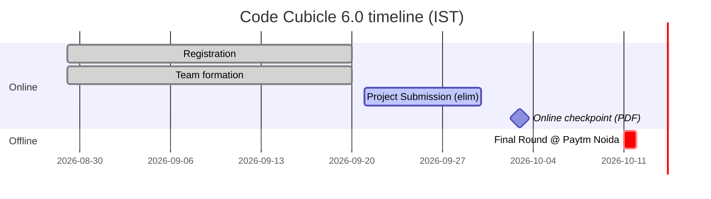

# 01 · Event Brief: Code Cubicle 6.0 × Cloudinary Challenge

> Everything factual about the event, deadlines, prizes, and submission mechanics, with the discrepancies between sources called out.
> Verified on **29 Sep 2026** against the live HackCulture page, the problem-statement PDF, Cloudinary's hackathon page, and the Cloudinary submission form.

---

## 1. Urgent: what's due and when

| When (IST) | What | Source | Action |
|---|---|---|---|
| **30 Sep 2026, 11:59 PM (tomorrow)** | **Project Submission round closes** (online elimination round, status shown as "Live") | HackCulture schedule | Log in to HackCulture today and check exactly what the submission form asks for. Submit a working MVP link, a public GitHub repo, and a strong README before this deadline. |
| 3 Oct 2026 | "3 OCT ONLINE" in the PS PDF footer | Problem-statement PDF (modified 22 Sep 2026) | Treat this as a probable online evaluation or checkpoint. Have a deployed demo plus a 2–4 min video ready by 2 Oct night. |
| 11 Oct 2026, 09:00–18:00 | **Final Round (offline)** at Paytm, One Skymark, Tower-D, Sector 98, Noida | HackCulture + PDF | Live demo + pitch. Top 3 selected. |
| Not stated | Cloudinary Challenge submission (Google Form, "Cloudinary Challenge Hackathon Survey") | Form dropdown lists "Code Cubicle 2026" | Submit **no later than 3 Oct**. The sibling HackIndia × Cloudinary event freezes code on 4 Oct 00:15 IST, which suggests Cloudinary judges this batch around then. Ask Geek Room/Cloudinary to confirm. |

> **Selection mechanics matter.** The HackCulture FAQ says finalists (~15–20 teams out of **3,700 registrations**) are selected on the *"overall GitHub and LinkedIn profiles of the team members"*. So the public repo (README quality, commit history, architecture docs) and every member's LinkedIn (a post about the build) are directly scored in round 1. See `05_execution/04_submission_checklist.md`.

---

## 2. Event facts

| Item | Detail |
|---|---|
| Event | **Code Cubicle 6.0**, "Where Builders Take Their Cubicles and Build" |
| Organizer | **Geek Room** (support contact: Manas Chopra, Co-Founder · team.geekroom@gmail.com) |
| Platform | HackCulture: https://hackculture.io/hackathons/code-cubicle-6-0 |
| Team size | 1–4 members; one team per person |
| Registrations | 3,700 (registration closed); 26,519 page impressions |
| Themes | (1) **AI-Powered Impact & Sustainability Media Platform (Cloudinary)**, (2) AI-Powered Data Intelligence Platform, (3) AI-Powered Edge Memory & Intelligence Platform (Qdrant Edge) |
| Our theme | **Problem Statement 02 · Cloudinary** |
| Partners | Cloudinary (**Track Sponsor**), Qdrant (Tech), Pathway (Tech), n8n (License), Logitech (Experience), Wayzyy (Travel), Eventopia (Media) |
| Finals venue | Paytm, One Skymark, Floor 6–22, Tower-D, Plot H-10 B, Sector 98, Noida 201304 |
| Cloudinary listing | Cloudinary's Creators Community page lists "Sep 26: Code Cubicle 6.0 (Delhi)" among its featured 2026 events, so Cloudinary DevRel is actively tracking this event. |

### Schedule (HackCulture)

---

## 3. Prizes

| Prize | Amount | Sponsor | Notes |
|---|---|---|---|
| **Cloudinary Challenge 1st** | **₹1,20,000 cash** | Cloudinary | "Best overall project for Cloudinary Challenge that is open for all." Info session: **₹30,000 Amazon.in gift card per teammate**, up to 4 = ₹1.2 L |
| **Cloudinary Challenge 2nd** | ₹40,000 (HackCulture) / ₹20,000 total (info session) | Cloudinary | **Discrepancy**: the site says ₹40K and the session transcript says ₹20K. Your "₹1.4 lakh" figure matches ₹1.2 L + ₹20K. |
| CC 6.0 General 1st / 2nd / 3rd | ₹12,000 / ₹10,000 / ₹8,000 | Geek Room | General problem-statement winners |
| n8n Cloud Pro licenses | $60 credits × 100 winners | n8n | Worth using n8n meaningfully (see solution) |
| Omnidimension Voice AI credits | $50 × 100 | Omnidimension | Voice AI (optional integration angle) |
| Logitech mouse | $100 × 5 | Logitech | Top participants |
| Goodies / certificates | | Geek Room | All participants get certificates |
| Cloudinary extras (per Cloudinary hackathon page) | Credits boost for winners **and honorable mentions**, featured on Cloudinary's platform | Cloudinary | Being *featured* is a realistic secondary goal |

Total pool per HackCulture: **$14K** (₹1.9 L cash + $11K credits + $1K other).

> Implication: a single strong Cloudinary project can compete for **both** the Cloudinary prize (₹1.2 L) and the general prizes, since the Cloudinary challenge is "open for all".

---

## 4. Cloudinary's official challenge requirements

From **https://cloudinary.com/pages/hackathons/** (`cld.media/hackathons` redirects here):

1. **"Use the React or Next.js AI Starter Kit and/or our AI Skills Pack or AI Power Start Prompt"**
2. **"Ship something functional and production-ready"**
3. **"Show an innovative use of Cloudinary's media capabilities"**
4. **Complete the feedback survey** (the Google Form)

Resources they list:

| Resource | Command / URL |
|---|---|
| React AI Starter Kit | `npx create-cloudinary-react` |
| Next.js AI Starter Kit | `npx create-cloudinary-next` |
| Skills Pack | `npx skills add cloudinary-devs/skills` (docs: cloudinary.com/documentation/cloudinary_llm_mcp#cloudinary_skills) |
| AI Power Start Prompt | cloudinary.com/documentation/ai_powerstart |
| Survey / submission | cld.media/hackathon-survey (the Google Form) |
| Free signup | link.cloudinary.com/unDBs ("no credit card required") |

From the info session: **submit a GitHub link and a live demo** (Netlify / Vercel / Render) via the Google Form (shared by Arpit Singh). Join the **Cloudinary Creators Community** (Discord: discord.com/invite/D8ddQj6KnH, interest form cld.media/c2).

---

## 5. The submission form, field by field

Form: "Cloudinary Challenge Hackathon Survey". Fields marked * are required.

| # | Field | Type | Our plan (drafts in `05_execution/04_submission_checklist.md`) |
|---|---|---|---|
| 1 | Hackathon Name* | Dropdown → **"Code Cubicle 2026"** | Select exactly this |
| 2 | Team name* | Text | |
| 3 | Contact email* | Text | |
| 4 | Brief project description* | Text | 2–3 sentences: problem → product → Cloudinary role |
| 5 | Project URL* | Text | Vercel production URL + demo login |
| 6 | GitHub URL* | Text | Public repo |
| 7 | **What were your project's media needs and how did you use Cloudinary?*** | Long text | **The most important field.** An enumerated integration list mapped to the problem. |
| 8 | Please rate Cloudinary* | 1–5 | Honest |
| 9 | Which of the below did you use?* | Multi-select: React AI Starter Kit, **Next.js Starter Kit**, **Skills Pack**, **AI Power Start Prompt**, none, Other | Tick every one we genuinely used (plan: Next.js kit + Skills + AI Power Start + MCP as "Other") |
| 10 | Rate the starter kit | 1–5 | |
| 11 | Rate the Skills Pack | 1–5 | |
| 12 | **If you used prompt engineering to build, what prompts did you try?*** | Long text | Keep a prompt log from day 1 (`05_execution/06_prompt_log.md`) |
| 13 | Public link to a recording walking through your project | Text | 2–4 min video (YouTube unlisted / Loom) |
| 14 | AI model(s) used to build | Text | e.g. Claude Opus 5.5 in Claude Code/Cursor + runtime models |
| 15 | Interested in follow-up conversation?* | Yes/No | **Yes.** A route to being featured. |

> This form doubles as **product research for Cloudinary's new AI developer tools** (it asks for ratings of the kits and Skills, the prompts, and the models). Thoughtful, specific feedback here signals the kind of engaged builder their DevRel team rewards. See `03_judging_and_what_cloudinary_wants.md`.

---

## 6. Rules that constrain the build

- Projects must be **built by the team**; original work; open-source tools, APIs and AI tools allowed **with credit** (keep a `CREDITS.md`, including datasets and photo sources).
- Cheating, plagiarism, or misconduct leads to disqualification. Don't reuse a previously built project wholesale. (The team's earlier Qdrant-edge repo in this folder is unrelated to this theme.)
- Selected teams **must attend offline** in Noida on 11 Oct.
- Organizers may modify schedule/rules, so re-check HackCulture announcements daily.

---

## 7. Open questions to confirm (email team.geekroom@gmail.com / ask on Cloudinary Discord)

1. What exactly is submitted on HackCulture by 30 Sep (repo only, or deployed link and video too)?
2. What happens on **3 Oct** ("3 OCT ONLINE" in the PDF)?
3. Deadline for the **Cloudinary Google Form** for Code Cubicle 2026.
4. Cloudinary 2nd prize: ₹40,000 or ₹20,000?
5. Who judges the Cloudinary prize (Cloudinary DevRel remotely, e.g. Jen Looper, or jury in Noida)?
6. Can Cloudinary grant a temporary **credit boost / add-on quota** for hackathon teams, and **beta access** to Content Provenance (C2PA `fl_c2pa`) and Duplicate Image Detection? (Both are "contact support" betas; see `02_cloudinary/07_availability_matrix.md`.)
