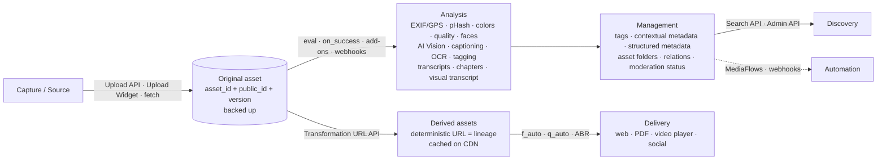

# 01 · Cloudinary: Company, Products & Mental Model

---

## 1. Company snapshot

| | |
|---|---|
| What | API-first, AI-powered platform to **upload, store, analyze, manage, transform, optimize, and deliver** images, video, and audio at scale ("the full media lifecycle"). |
| Age / funding | ~12–14 years old (founded 2012); described in the info session as **bootstrapped** and developer-focused. |
| Customers | Nike, Aritzia, Swarovski and other large catalogs (info session). |
| Positioning (llms.txt, 2026) | *"A multi-product platform that provides API-first, AI-powered image and video APIs, digital asset management, and workflow automation… to automate their full media lifecycle at scale."* |
| DevRel | Jen Looper (Director of Developer Relations since May 2025; head judge on the hackathon circuit), Cloudinary Creators Community ("From Cloud to Crowd"), Cloudinary Academy. |

## 2. Product lines (2026)

| Product | What it is | Relevance to PS-02 |
|---|---|---|
| **Cloudinary Image** | Image APIs: upload, URL-based transformations (incl. generative AI), optimization (`f_auto`, `q_auto`), CDN delivery, **Image Generation API** (text→image, image→image; model families Nano Banana, Flux, GPT Image; `model.mode: auto`) | Composites, overlays, social kits, redaction, PDF packs |
| **Cloudinary Video** | Transcoding, ABR streaming (HLS/DASH, `sp_auto`), video transformations (trim, splice, transitions, overlays, subtitles), **Video Player** (v4, chapters, transcripts, AI highlights), **transcription + translation**, **auto chapters**, **AI titles/descriptions/tags** (`auto_video_details`), **AI Video Analysis** (visual transcription), **Image-to-Video**, **Video Canvas** | Video evidence understanding + impact reels |
| **Cloudinary Assets (DAM)** | Media Library UI, structured metadata, collections, portals, creative approval, Visual Search (Enterprise), People Search (Enterprise), **AI Agents** (Taxonomy/Search/Workflow; Beta, Assets Enterprise) | Structured metadata schema; reviewer workflows (Media Library moderation queue) |
| **MediaFlows** | Low-code automation: **EasyFlows** (step wizard) and **PowerFlows** (drag-and-drop canvas); triggers on upload/metadata/schedule; blocks for AI (Gemini analyze, generate alt text, video chaptering/transcription, image generation, image-to-video), notifications (Slack/Teams/webhooks), conditions (JsonLogic); **MediaFlows MCP server**; Workflow Agent | Automations: notify reviewers of flagged evidence, auto alt-text, export transcripts |
| **Cloudinary Moderation** (new product; GA Apr 2026) | AI review against custom rules for **quality, brand, compliance, authenticity** (AI-generated detection, web-sourced/stock detection, duplicates), images **and** videos (frames, on-screen text, audio); human-in-the-loop; audit trail. Free plan: **500 moderation actions** (assets × rules); AI-generated & web-sourced detection and ongoing moderation are **advanced-plan** | Authenticity checks for evidence (upgrade path; see availability matrix) |
| **Integrations** | 1000+ via n8n node, CMS/e-comm plugins, Figma, CI HUB, Chrome extension, Box/OneDrive/SharePoint sources in the Upload Widget | n8n ingestion channel (sponsor alignment) |

## 3. The mental model to use when designing



### Core concepts to know

| Concept | Meaning | Why it matters for evidence |
|---|---|---|
| `public_id` | Your chosen name/path of the asset | Encode a stable evidence ID (e.g. `ev_01J…`) |
| `asset_id` | Immutable Cloudinary-generated unique ID | Primary key for provenance |
| `version` | Timestamp-like version number in URLs (`v1784…`) | Pins a derivative to an exact original version |
| **Backups & versions** | Auto-backup and revision tracking (available on Free) | Originals recoverable; version history = tamper evidence |
| **Derived asset** | Output of a transformation URL; generated once, then cached | **The URL itself is the recipe.** Reproducible lineage. |
| **Named transformation** (`t_name`) | Saved transformation chain | Policy-enforced outputs (e.g. `t_public_safe` = face pixelation + watermark) |
| **Baseline transformation** (`bl_name`) | Caches an expensive step (e.g. AI) once, variations cost 1 tx | Cost control for AI transforms |
| **Upload preset** | Server-side template of upload options (incl. add-ons, scripts, metadata) | Enforces our intake pipeline for every upload channel |
| `eval` (pre-upload) / `on_success` (post-upload) | JavaScript executed **inside Cloudinary** during upload | Intake gate: tag `no_gps`, `blurry`, `has_people`; write metadata from analysis results |
| **Structured metadata** | Typed fields (string, integer, date, enum, set) with validation, defaults, mandatory, conditional rules; searchable | Our evidence schema: project, site, activity, SDG, phase, trust score, consent… |
| **Contextual metadata** (`context`) | Free-form key-value pairs | Captions, alt text, AI summaries |
| **Tags** | Flat labels; also power `multi`/archive/list operations | Grouping for PDF packs, pairs, flags |
| **Relations** (`add_related_assets`) | Bidirectional links between up to 10 assets per call | Before↔after, video↔transcript, original↔story asset |
| **Moderation** | Per-asset `moderation_status` (pending/approved/rejected) with manual override, listable via API and Media Library | Human review queue for low-trust evidence |
| **Notifications (webhooks)** | POST to your URL on upload/analysis/moderation/metadata events | Drives our async pipeline |

### URL anatomy (the core of Cloudinary)

```
https://res.cloudinary.com/<cloud_name>/<asset_type>/<delivery_type>/<transformations>/<version>/<public_id>.<ext>
                                          image|video|raw  upload|authenticated|fetch|multi…   comma = same step, slash = next step
```

Example (before/after composite with labels, optimized):
```
https://res.cloudinary.com/<cloud>/image/upload/
  c_fill,g_auto,w_600,h_450/
  l_pramaan:ev_after123/c_fill,g_auto,w_600,h_450/fl_layer_apply,g_west,x_600/
  co_white,b_rgb:00000099,l_text:Arial_24_bold:BEFORE%20%C2%B7%2012%20Mar%202025/fl_layer_apply,g_north_west,x_12,y_12/
  co_white,b_rgb:00000099,l_text:Arial_24_bold:AFTER%20%C2%B7%2018%20Sep%202026/fl_layer_apply,g_north_west,x_612,y_12/
  f_auto/q_auto/
  v1784151459/pramaan/ev_before456.jpg
```
(Public IDs with folders use `:` instead of `/` inside `l_` layers.)

## 4. Strategic direction (2025–2026): read this before designing

1. **Agent-first platform.** Claimable Cloud (`npx @cloudinary/cloud`), `cld agent signup`, "AI agent" API-key type, llms.txt, "Agents: start here" docs, MCP servers (Asset Management, Environment Config, Structured Metadata, Analysis, MediaFlows), Skills Pack, plugins for Claude/Cursor/ChatGPT/Codex, VS Code extension. **Cloudinary wants to be the media layer that AI agents use.** A project that has an AI agent *operate* Cloudinary at runtime lands directly on this bet.
2. **From transformation company to "media intelligence" company.** AI Vision (LLM visual Q&A with structured JSON output since Feb 2026), Analyze API, AI Video Analysis (Aug 2026), auto video details, Moderation product, AI Agents in DAM. The PS title is literally *"media intelligence platform"*.
3. **Generative media inside the pipeline.** Image Generation add-on (Jul 2026), image-to-image with references (Aug 2026), Image-to-Video (Aug 2026, all accounts, trial credits), generative transformations (fill, remove, replace, recolor, restore, background replace), auto-enhance.
4. **Trust & governance.** Moderation (AI-generated/web-sourced detection), Content Provenance (C2PA `fl_c2pa`, beta), Roles & Permissions, audit trails, People Search.
5. **Visual, low-code composition.** Console Studio, Video Canvas (applets backed by named transformations), MediaFlows canvas redesign, Video Player Studio.

> **Design implication:** a winning PS-02 project should touch **(1) agentic operation, (2) AI perception, (3) media generation from evidence, and (4) trust/provenance**, which are Cloudinary's four current strategic bets, while staying cost-aware.
