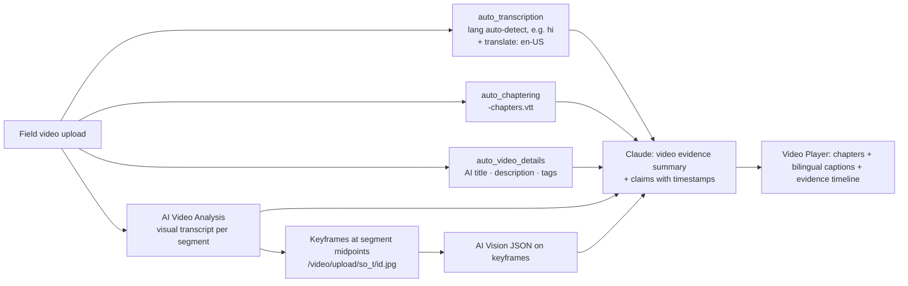

# 03 · Cloudinary AI & Analysis Stack: Deep Dive

> How each AI capability works, what it returns, what it costs, its limits, and exactly how it plugs into an **evidence** pipeline. This is the "perception layer" of our solution.

---

## 1. The Analyze API (Public Beta): one front door for image AI

- Base URL: `https://api.cloudinary.com/v2/analysis/<cloud_name>/analyze/<model>`
- Auth: Basic (API key:secret). Body: `{"source": {"uri": "<https url>"} | {"asset_id": "<id>"}, ...model params}`
- **Works on images not stored in Cloudinary** (any `uri`). This matters because we can analyze **a derived URL**, e.g. a before/after composite or a video keyframe (`/video/upload/so_12/<id>.jpg`), without storing it.
- Every response carries `limits.addons_quota[]` with `used_by_request`, `remaining`, `limit`, `reset_time`. **Log it on every call** and surface it in an admin panel to avoid quota surprises.
- Some models are async and return `{task_id, status: "pending"}`; poll `tasks/getStatus`.
- Typed TS SDK: **`@cloudinary/analysis`** (v0.4.2, Jul 2026; the same package that powers the Analysis MCP server). Exposes `analyzeAiVisionGeneral`, `analyzeAiVisionTagging`, `analyzeAiVisionModeration`, `analyzeCaptioning`, `analyzeCoco`, `analyzeLvis`, `analyzeUnidet`, `analyzeCldText`, `analyzeImageQuality`, `analyzeWatermarkDetection`, `analyzeGoogleTagging`, `analyzeGoogleLogoDetection`, `analyzeHumanAnatomy`, `analyzeShopClassifier`, `tasksGetStatus`, with typed errors (`RateLimitedResponseError` 429, etc.) and built-in retries.

| Endpoint | Add-on | Evidence use |
|---|---|---|
| `ai_vision_general` | AI Vision | **Primary.** One call per image with a JSON schema → scene summary, activity, counts, people/minors, visible text, recapture/AI cues, claim-match, change measures |
| `ai_vision_tagging` | AI Vision | Org-specific taxonomy classification (≤10 definitions per call) |
| `ai_vision_moderation` | AI Vision | Policy yes/no (e.g. "Is a child the main subject?") |
| `captioning` | Content Analysis | Cheap one-line caption / alt text |
| `coco` / `lvis` / `unidet` | Content Analysis | Object lists + boxes (LVIS ≈ 1,200 categories) for counts and object-aware crops |
| `cld_text` | Content Analysis | Does the image contain text, and where (signboards, registers, screens) |
| `image_quality` | Content Analysis | IQA score for triage |
| `watermark_detection` | Content Analysis | Stock/web-sourced giveaway |
| `google_tagging`, `google_logo_detections` | Google Auto Tagging | Generic labels; logos (e.g. a CSR sponsor logo on a banner) |

## 2. AI Vision: LLM visual understanding (the centerpiece)

**What it is:** an LLM-backed service that "interprets and responds to visual content queries". Two main modes, plus a moderation mode exposed in the SDK:

### 2.1 Tagging mode: your taxonomy, not Google's
```json
POST …/analyze/ai_vision_tagging
{
  "source": {"asset_id": "3f1c…"},
  "tag_definitions": [
    {"name": "sapling_plantation", "description": "Newly planted saplings, pits, tree guards or planting activity"},
    {"name": "check_dam", "description": "A small masonry, gabion or earthen dam across a stream or nala"},
    {"name": "farm_pond", "description": "An excavated pond on farmland, lined or unlined"},
    {"name": "school_infrastructure", "description": "Classrooms, toilets, drinking water or furniture in a school"},
    {"name": "sanitation", "description": "Toilets, handwashing stations, drainage or waste bins"},
    {"name": "solar_installation", "description": "Solar panels, solar pumps or solar street lights"},
    {"name": "training_session", "description": "A group of people attending a training, meeting or demonstration"},
    {"name": "health_camp", "description": "Medical check-ups, health workers, patients or medical equipment in a camp"},
    {"name": "water_body_restoration", "description": "Desilting, restored pond or lake, inlet/outlet works"},
    {"name": "waste_management", "description": "Waste segregation, collection vehicles, composting or recycling"}
  ]
}
```
Max **10 definitions per call** → for larger taxonomies, run a coarse call first and then a fine call within the matched family, or put the taxonomy into a `general` JSON-schema prompt as an enum.

### 2.2 General mode with **structured JSON output** (Feb 2026)
Put a fenced JSON Schema inside the prompt; responses are guaranteed to conform (the underlying LLM's structured-output feature). The response's `data.analysis.responses[0].value` is a JSON string to parse. **One call can replace 5–8 separate calls**, which matters because billing is by tokens.

Evidence schema we propose (abridged; full version in `04_solution/05_ai_pipeline_design.md`):
```json
{
  "type": "object",
  "properties": {
    "scene_summary": {"type": "string", "description": "<= 30 words, factual, no speculation"},
    "activity": {"type": "string", "enum": ["sapling_plantation","check_dam","farm_pond","school_infrastructure","sanitation","solar_installation","training_session","health_camp","water_body_restoration","waste_management","other","unclear"]},
    "activity_matches_claim": {"type": "string", "enum": ["yes","no","uncertain"]},
    "visible_counts": {"type": "array", "items": {"type": "object", "properties": {"object": {"type":"string"}, "approx_count": {"type":"integer"}}, "required": ["object","approx_count"], "additionalProperties": false}},
    "people": {"type": "object", "properties": {"present": {"type":"boolean"}, "approx_count": {"type":"integer"}, "minors_likely": {"type":"boolean"}}, "required": ["present","approx_count","minors_likely"], "additionalProperties": false},
    "visible_text": {"type": "string"},
    "recapture_suspected": {"type": "boolean", "description": "Photo of a screen, monitor, printed photo or poster"},
    "recapture_cues": {"type": "string"},
    "synthetic_suspected": {"type": "boolean", "description": "Signs of AI generation or heavy compositing"},
    "synthetic_cues": {"type": "string"},
    "setting": {"type": "string", "enum": ["rural","urban","peri_urban","forest","water_body","farmland","indoor","unclear"]},
    "season_weather_cues": {"type": "string"},
    "change_measures": {"type": "object", "properties": {"vegetation_cover_pct": {"type":"integer"}, "construction_stage": {"type":"string","enum":["not_started","excavation","foundation","structure","finishing","complete","not_applicable"]}, "water_present": {"type":"boolean"}}, "required": ["vegetation_cover_pct","construction_stage","water_present"], "additionalProperties": false}
  },
  "required": ["scene_summary","activity","activity_matches_claim","visible_counts","people","visible_text","recapture_suspected","recapture_cues","synthetic_suspected","synthetic_cues","setting","season_weather_cues","change_measures"],
  "additionalProperties": false
}
```
The prompt text above the schema injects the **claim context** (project, claimed activity, claimed site description, capture date) so `activity_matches_claim` is meaningful.

### 2.3 Token economics
- Billed in **tokens** (image input + text in + text out); the doc example shows ~2,100 tokens for one request.
- **Reduce image tokens** by sending a downscaled derived URL (e.g. `c_limit,w_1024/f_jpg/q_auto`) instead of a 12-MP original. This is a Cloudinary-native cost optimization worth mentioning to judges.
- The free-tier quota is not published in docs (visible in Console → Add-ons). **Check it on day 0** and size the demo corpus accordingly. Ask Cloudinary DevRel for a hackathon boost.

## 3. Content Analysis add-on
- On upload: `detection: "captioning"` (also `"coco"`, `"lvis"`, `"iqa"`, `"watermark"`, `"cld"`…), results in `info.detection.*`, usable in `on_success` to write metadata.
- Captioning example output: *"Vibrant pink dahlia flowers with yellow centers stand out against a lush green foliage backdrop."*
- Quotas shown in examples as `object_detection` units (e.g. limit 500), so treat it as scarce on Free.
- Also powers **object-aware cropping** (`g_auto:<object>`), e.g. crop to the check dam for thumbnails.

## 4. Native (no add-on) analysis on upload: free and underrated
| Param | Returns | Evidence signal |
|---|---|---|
| `media_metadata: true` | EXIF (DateTimeOriginal, Make, Model, Software), GPS (lat/lng/alt), IPTC, XMP (incl. potential `DigitalSourceType`, C2PA hints) | Provenance, geofence, device consistency, editing-software traces, AI-generation declarations |
| `phash: true` | 64-bit perceptual hash | Reuse/duplicate detection via Hamming distance (we index in Postgres) |
| `colors: true` | Predominant colors & histogram | Vegetation proxy (% green), scene consistency |
| `faces: true` | Face boxes | Consent/redaction workflow |
| `quality_analysis: true` | Focus/noise/etc. | Blurry-evidence triage |
| `accessibility_analysis: true` | Colorblind score | Accessible report styling |

All of these are also readable inside `eval` as `resource_info.*`, so **the intake gate can run inside Cloudinary before the asset is finalized.**

## 5. Video intelligence chain



| Step | Cost/limits | Notes |
|---|---|---|
| `auto_transcription` | Native; translation needs Google Translation add-on | Word-level timings + confidence → paced subtitles, searchable quotes; not available in the Asia-Pacific data center, so **create the cloud in US/EU default**. |
| `auto_chaptering` | Native | `<id>-chapters.vtt`; Video Player `chapters: true` picks it up automatically |
| `auto_video_details` | +1 tx/s | Works on videos **with dialogue**; stores title/description in context + generates tags |
| AI Video Analysis | **+20 tx/s**, charged every run | Beta. Use for short clips only (≤30 s) on Free. Prompt it, e.g. *"Describe construction progress, materials, number of workers, and any visible signage."* |
| Keyframe extraction | 1 tx per derived frame | `so_<sec>` on a video URL with `.jpg` returns a frame |

## 6. Cloudinary Moderation (new product, GA Apr 2026)
- Rules-based AI review (built-in + custom rules) for images **and** videos; flags/rejects by threshold; explainable results; human override; **full audit trail**; results stored as asset metadata; can trigger workflows.
- Checks relevant to evidence: blurry/low-res, duplicates/near-duplicates, **AI-generated content**, **unlicensed/web-sourced imagery**, watermarks, screenshots, "identifiable people where not allowed", on-screen text and spoken claims in videos.
- **Free plan: 500 moderation actions** (= assets × rules). **AI-generated detection, web-sourced detection, and ongoing (automatic) moderation are advanced-plan features.**
- Design stance: our Trust Score works on Free; Cloudinary Moderation is the **production upgrade path** for authenticity signals. Show it in the architecture as a pluggable signal provider, and if the team gets a demo/advanced trial, wire it in.

## 7. Duplicate Image Detection (Beta, on request)
- `moderation: "duplicate:<threshold>"`; async; the webhook returns matching public IDs with confidence; approved images join the search set; manual override in the Media Library.
- Robust to resize, format/quality changes, blur, small overlays; **less robust to meaningful crops** (a 90% crop is often not detected).
- Fallback that works on Free: `phash: true` + our own Hamming search (see `04_solution/07_evidence_integrity_and_traceability.md`). **Request beta access anyway**, since it's a nice "native" signal.

## 8. What Cloudinary AI **cannot** do for us (so we build it)

| Gap | Why | Our component |
|---|---|---|
| Cross-asset reasoning (compare 2+ images, reason over a project) | AI Vision takes one `source` | Claude over multiple Cloudinary URLs, **or** Cloudinary composite → AI Vision (trick in §9) |
| Semantic/vector search on Free | Visual Search is Enterprise | Embeddings (Voyage multimodal) + pgvector |
| Geo/EXIF-date search on Free | Search Tier 2 is premium | Copy to SMD (`capture_date`, `lat_e6`, `lng_e6`) + PostGIS |
| Tamper-evident audit log | Not a Cloudinary feature | Hash-chained ledger in Postgres |
| Trust scoring | Signals exist but are spread across features | Trust engine combining signals, with explanations |
| Indicator/impact accounting | Not a DAM concept | Project/indicator model + evidence coverage metrics |
| Report narrative with citations | – | Claude structured output grounded in evidence JSON |

## 9. Signature technique: "compose, then perceive"
Because the Analyze API accepts any URI, we can **use Cloudinary transformations to construct the exact visual question** and then ask AI Vision about it:

1. Build a side-by-side composite URL of *before* (left) and *after* (right), normalized to the same size, with "BEFORE"/"AFTER" labels.
2. Call `ai_vision_general` on that URL with a comparison schema: `{same_location: yes|no|uncertain, viewpoint_similarity: 0-100, changes: [..], vegetation_change_pct_estimate, construction_progress, confidence}`.
3. Store the result on the pair; show the composite and the answer together.

This keeps comparison *inside* Cloudinary's stack (a concrete example of "deep integration") and costs one AI Vision call per pair.
