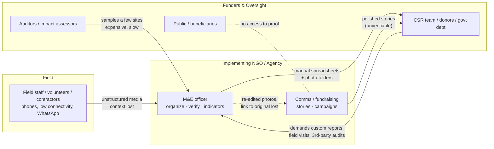

# 01 · Root-Cause Analysis: What the Problem Actually Is

> The PS describes a *symptom* ("organizing and reporting field media is slow and hard to scale"). A winning solution has to address the **root cause**. This file traces symptom → cause → root with evidence, and ends with the design principles that follow.

---

## 1. The surface problem (as stated)

> "Manually organizing, analyzing, verifying, and turning this media into meaningful evidence and reports is time-consuming and difficult to scale."

If we stopped here, the solution would be "an AI photo organizer with a report button". That is what most teams will build.

## 2. Five Whys

| Level | Question | Answer (with evidence) |
|---|---|---|
| **Why 1** | Why is field media hard to turn into reports? | It arrives **unstructured and context-stripped**: thousands of `IMG_2034.jpg` files in WhatsApp groups, Drive folders and phones, with no link to project, site, activity, or indicator. Messaging apps commonly strip EXIF (incl. GPS/time). Someone has to reconstruct context by hand. |
| **Why 2** | Why does context have to be reconstructed by hand at all? | Because in this domain **a photo is a claim**: "this check dam was built", "these 500 saplings were planted at site X on date Y". The report is only useful if the claim is attributable to a place, time and project. Organizing *is* evidence-building, and today it's manual. |
| **Why 3** | Why can't organizations just trust and publish what field teams send? | Because **the evidence is unreliable and everyone knows it**. India's own experience: after the NMMS app made geotagged photo attendance mandatory for MGNREGS, the Ministry of Rural Development (circular, **8 July 2025**) ordered **manual verification** because of *"photographs of photographs"*, irrelevant images, fake photos, mismatched counts and duplicate entries. (In April 2024, a Rajasthan worksite supervisor uploaded a **photo of two dogs** as attendance for nine workers.) Photo monitoring does help: after it was enforced, nearly **13 crore fake workdays (≈₹2,600 crore)** were uncovered in Rajasthan alone between Nov 2024 and Jun 2025. But fraud then adapted to the photos themselves. Globally, a nine-month Guardian/Die Zeit/SourceMaterial investigation (2023) found **>90% of Verra rainforest offsets likely "phantom credits"**. Visual claims without verification don't hold up. |
| **Why 4** | Why is verification manual and unscalable? | Because verification signals exist but are **scattered and invisible**: EXIF, GPS, device, perceptual similarity to other photos, whether it's a photo of a screen, whether the scene matches the claimed activity, whether it's AI-generated. Nobody computes them together. GeoMGNREGA's before-during-after geotagging still relies on **block-level GIS supervisors and state nodal officers** to validate, a human bottleneck for crores of assets. |
| **Why 5 (root)** | Why are the signals never brought together, and why does verified evidence still not become stories? | Because **the tools treat media as content, not as evidence**. DAMs optimize for brand assets; survey tools (ODK/Kobo) capture photos as form attachments; messaging apps destroy metadata; comms teams re-edit photos in Canva and **break the link to the original**. Evidence (M&E) and stories (comms/fundraising) live in separate workflows, so every report is rebuilt from scratch, and edited or AI-enhanced "impact photos" can't be traced back to what was actually captured. |

### Root cause statement

> **Field media has no evidence chain.** From capture to campaign, nothing preserves *who / when / where / what / how-it-was-changed* in a form that machines can verify and humans can trust. So organizations pay three times: to **organize** (reconstruct context), to **verify** (manual checks that don't scale), and to **re-tell** (rebuilding reports and stories whose credibility can't be proven).

## 3. The "trust gap" model

Every arrow crossing the org boundary is where **trust leaks** and **cost accumulates**:
- Donors ask for **custom** reports and stories. Since the start of 2025, **42%** of nonprofits saw increased demand for custom impact reporting, **44%** saw more requests for custom impact stories, and **49%** say donors rarely or never fund that effort (Benevity, 2025).
- CSR law in India makes this structural: companies with an average CSR obligation ≥ ₹10 crore must commission **independent impact assessments** of projects with outlay ≥ ₹1 crore (Companies (CSR) Rules, Rule 8(3)), in an ecosystem spending **~₹35,000 crore a year** across ~60,000 projects (FY 2023-24, National CSR Portal figures as reported).
- Privacy law is tightening: under India's **DPDP Act 2023** (Rules 2025; core obligations phased in through **13 May 2027**), photographing beneficiaries is processing personal data. It needs consent, and **verifiable guardian consent for children**, plus deletion on withdrawal.

## 4. Problem decomposition (what a complete solution must fix)

| # | Sub-problem | Root mechanism | Consequence | Solution capability needed |
|---|---|---|---|---|
| P1 | **Context loss at capture** | Metadata stripped/absent; no project/site linkage | Hours of manual sorting; misfiled evidence | Capture-time provenance (app-attached GPS/time/project) + AI inference of project/site/activity for imports |
| P2 | **Unverifiable claims** | No automated verification; signals unused | Fraud, recycled photos, donor distrust, manual audits | Multi-signal **Trust Score** with explanations + human review |
| P3 | **Undiscoverable archives** | Folders + filenames; no semantic index | Evidence can't be found when a donor asks | Structured metadata + NL/semantic + geo/time search |
| P4 | **Change not demonstrated** | Before/after photos taken inconsistently, never paired, never measured | "We planted trees" but can't show survival/progress | Auto-pairing by site/viewpoint + comparison + quantified change with a stated method |
| P5 | **Evidence → story is manual** | Separate teams/tools; re-editing | Reporting burden; inconsistent narratives | Story Studio generating reports/social/reels **from** verified evidence |
| P6 | **Broken lineage** | Edits/crops/AI enhancement detach from originals | Greenwashing risk; can't answer "is this real?" | Lineage graph + classified transformations + tamper-evident ledger + public verification (C2PA-ready) |
| P7 | **Privacy & dignity** | Faces of beneficiaries/children published without consent tracking | Legal (DPDP) and ethical harm | Face detection → consent state → automatic redaction in public outputs |
| P8 | **Scale & connectivity** | Rural field conditions; many orgs | Tools that assume broadband and one org fail | Offline-first capture, low-bandwidth delivery, multi-tenant model |

## 5. Why now

1. **Generative AI makes fabricated evidence trivial.** Anyone can now generate a convincing "after" photo. Authenticity signals and provenance (C2PA) are becoming table stakes, and Cloudinary itself launched Moderation with AI-generated detection (GA Apr 2026) and C2PA signing (beta).
2. **Mandates are tightening**: CSR impact assessments, SEBI's BRSR disclosures for listed companies, DPDP consent obligations, and government progress-linked fund release (GeoMGNREGA before/during/after geotagging).
3. **Multimodal AI is finally cheap and good enough** to understand field photos and video (speech + visuals) at scale, and Cloudinary packages much of it (AI Vision JSON, transcription, AI Video Analysis).

## 6. Design principles derived from the root cause

1. **Evidence first, content second.** Originals are immutable; everything shown or published is a *declared derivative*.
2. **Capture context at the source**, and when you can't, *infer it and label it as inferred*.
3. **Verification is a score with reasons, not a verdict.** Machines triage; humans decide; everything is logged.
4. **One pipeline from evidence to story.** Stories are generated *from* verified evidence and cite it.
5. **Every pixel traceable.** Any published image resolves back to its original, its capture data, and every transformation applied.
6. **Honest AI.** Generative AI never touches evidence; in stories it is labeled.
7. **Privacy by transformation.** Redaction is applied at delivery by policy, not by trusting people to remember.
8. **Built for the field.** Offline-first, low-bandwidth, multilingual.
9. **Cost-aware at scale.** Analyze once at ingest; cache; deterministic derivatives.
