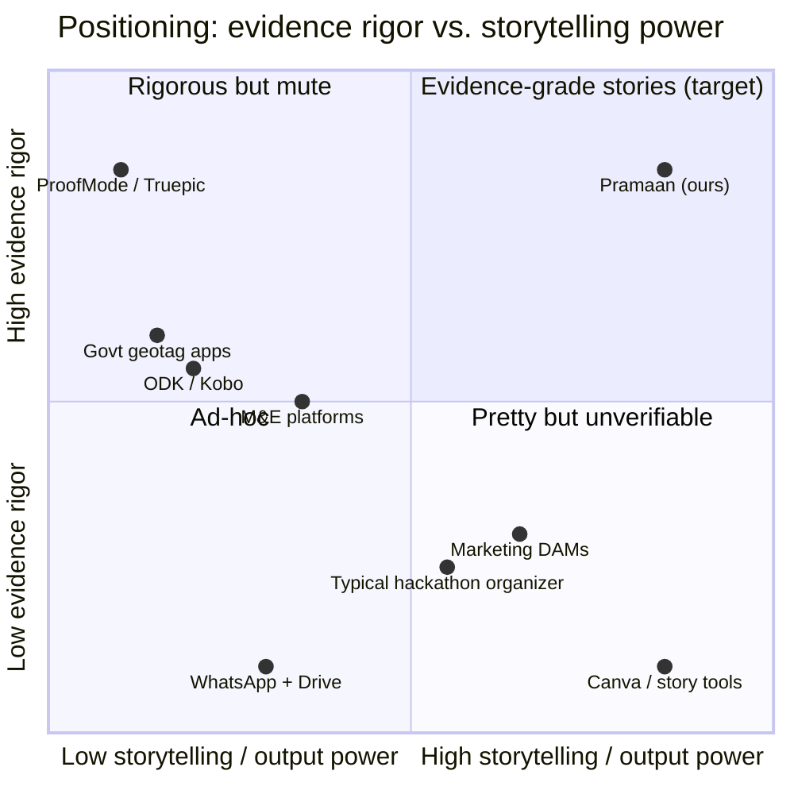

# 04 · Existing Solutions & the Gap We Fill

> Judges will ask "doesn't X already do this?" This maps the landscape and positions our product precisely.

---

## 1. Landscape

| Category | Examples | What they do well | Where they fall short for PS-02 |
|---|---|---|---|
| **Field data-collection** | ODK Collect, KoboToolbox, SurveyCTO, CommCare | Offline forms, GPS, photo/audio fields, humanitarian-grade, free/open (ODK/Kobo) | Media is a **form attachment**: no visual understanding, no reuse/recapture detection, no before/after, no storytelling, weak media search |
| **Govt geotagging apps** | Bhuvan (GeoMGNREGA), NMMS, AwaasApp | Capture-time GPS + time (encrypted at upload), stage-wise (before/during/after) workflows | **Manual validation** by block/state officers; gamed via photos of photos and recycled images (MoRD, Jul 2025); closed, single-purpose |
| **Capture-authenticity** | ProofMode (Guardian Project, open source), Truepic | Cryptographic proof / C2PA at capture | Stops at authenticity: no organization, AI understanding, comparison, reporting, or stories |
| **Marketing DAMs** | Bynder, Brandfolder, Canto, Cloudinary Assets | Organization, metadata, brand workflows, distribution | Built for **brand content**, not evidence; enterprise-priced; no trust scoring or impact indicators |
| **M&E / impact platforms** | ActivityInfo, DevResults, Sopact and similar | Indicators, logframes, dashboards | Photos are attachments; no media intelligence; no provenance for visuals |
| **Consumer photo tools** | Google Photos, Drive, WhatsApp | Good consumer search, sharing, ubiquitous | No project/site/indicator semantics; metadata stripped (WhatsApp); privacy concerns; no verification |
| **Remote-sensing MRV** | Satellite MRV providers (e.g. Planet-based, carbon rating firms) | Landscape-scale change detection | Can't see **ground truth** (sapling survival under canopy, a classroom, a toilet, a training); complementary |
| **Story/design tools** | Canva, Shorthand, annual-report builders | Beautiful outputs fast | **Break lineage** to originals; no redaction policy; no evidence citations |
| **Hackathon competitors** | "AI smart photo organizer + report generator" | Tagging, gallery, LLM summary | No trust layer, no lineage, shallow Cloudinary usage |

## 2. The gap

No existing category connects all four stages:

**capture authenticity → AI understanding & organization → verified comparison → evidence-cited storytelling, with traceability throughout.**

## 3. Positioning statement

> **For** NGOs, CSR teams and public agencies **who** must prove on-the-ground impact with photos and video, **Pramaan** is an **evidence layer for impact media** that turns raw field media into verified, searchable, comparable evidence and generates evidence-cited reports and campaigns where every pixel traces back to its original. **Unlike** DAMs, survey tools or story tools, Pramaan treats every photo as a *claim to be verified*, not content to be decorated, and it's built on Cloudinary so it scales from one NGO to a national program.

## 4. Coexist, don't compete (integration story)

| Existing tool | How Pramaan connects |
|---|---|
| ODK / Kobo / SurveyCTO | Import submissions' media via their APIs (or n8n) → Cloudinary upload with form fields mapped to structured metadata |
| WhatsApp groups | n8n / WhatsApp Business Cloud API bridge → upload with `source_channel=whatsapp`, provenance marked "imported (metadata stripped)" |
| Google Drive / OneDrive / SharePoint / Box / Dropbox | Upload Widget sources (Box/OneDrive/SharePoint added Aug 2026) |
| M&E platforms | Export indicator-evidence coverage (CSV via MediaFlows "Export Metadata to CSV" or our API) |
| Canva / design tools | Our Story Studio outputs carry a "Verify" QR and provenance link, so even designed assets stay traceable |
| Satellite MRV | Optional: overlay satellite context tiles (Cloudinary `fetch`) next to ground photos as corroboration |

## 5. Competitive moat (for the pitch)

1. **Trust Score** built from signals that directly target documented fraud modes (recapture, reuse, location/time mismatch, irrelevant images).
2. **Lineage by construction**: Cloudinary's deterministic transformation URLs + versions + relations + our hash-chained ledger + C2PA readiness.
3. **Evidence-to-story in one pipeline** with a **generative firewall**.
4. **Field-first** (offline, low bandwidth, Hindi voice) and **CSR-ready** (Rule 8(3) packs, evidence coverage metrics).
5. **Cost-efficient at scale** on Cloudinary's CDN + analyze-once architecture.
