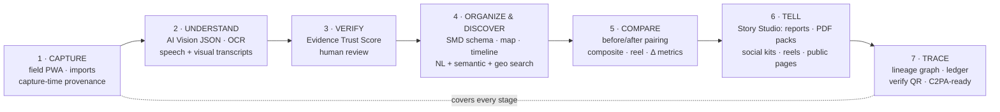

# 01 · Solution Concept: **Pramaan** (प्रमाण, "proof")

> **Pramaan is the evidence layer for impact media.** It turns raw field photos and videos into verified, searchable, comparable evidence, and then into reports and campaigns where every pixel traces back to its original. Cloudinary is the engine throughout.

Alternate names if needed: *Saakshya* (साक्ष्य, evidence), *GroundTruth*, *ImpactLens*. The rest of this doc uses **Pramaan**.

---

## 1. One-liners (use consistently everywhere)

- **Tagline:** *From field photo to verified impact. Every pixel traceable.*
- **Elevator (15 s):** "NGOs and CSR teams prove their impact with photos, but photos can be recycled, faked, or lose their context. Pramaan uses Cloudinary's AI to understand, verify and organize field media, shows before-and-after change, and generates reports and campaigns that link every image back to its verified original."
- **For the Cloudinary form (brief description):** "Pramaan is an AI media-intelligence platform for NGOs, CSR teams and government programs. It ingests field photos/videos (offline-capable), understands them with Cloudinary AI Vision and video AI, scores their authenticity, organizes them by project, site and timeline, pairs before/after evidence, and generates evidence-cited reports, social kits and reels via Cloudinary transformations, with full provenance for every derivative."

## 2. The seven pillars (mapped to the PS)

| Pillar | What it does | PS goal | Signature Cloudinary features |
|---|---|---|---|
| **1 · Capture** | Offline-first PWA + bulk import (Drive/OneDrive/SharePoint/Box/URL) + optional WhatsApp bridge; attaches GPS, time, project, activity, phase at capture; computes a client-side SHA-256 | R1 (+R6) | Signed Upload Widget, upload presets, chunked upload, `eval` intake gate, `source_url` provenance |
| **2 · Understand** | Per-image AI understanding against the org's taxonomy; counts, visible text, people/minors, setting; videos → speech transcript, visual transcript, chapters, AI title/tags | R1, R2 | AI Vision (JSON schema), captioning, OCR, `media_metadata`, `auto_transcription`, `auto_chaptering`, `auto_video_details`, AI Video Analysis |
| **3 · Verify** | Explainable **Evidence Trust Score** (provenance, integrity, relevance, quality) → Verified / Needs review / Flagged; reviewer queue; overrides logged | "verifying", "reliable" | `phash`, `quality_analysis`, `faces`, EXIF/XMP, AI Vision cues, watermark detection, moderation status; (Duplicate Detection / Moderation when granted) |
| **4 · Organize & Discover** | Structured metadata schema; project → site → timeline; map; NL search ("check dams near Jhabua before monsoon, trust ≥ 80") with "why matched"; find-similar | R1, R5 | Structured metadata, asset folders, tags, Search API expressions, `relate_assets`; + embeddings (Visual Search is Enterprise) |
| **5 · Compare** | Auto-suggest before/after pairs (same site + similar viewpoint + time gap); slider; labeled composite; cross-fade reel; AI comparison of the composite; deterministic Δ-metrics (e.g. green-cover index) | R3 | Overlays/side-by-side, text layers, `fl_splice:transition`, AI Vision on composite URL, `relate_assets` |
| **6 · Tell** | Story Studio: donor-specific report (web + PDF) with citations to evidence IDs; social kit (1:1, 4:5, 9:16, 16:9); 20-s reel with subtitles; public story page with OG image; indicator dashboard with **evidence coverage** | R4, "measurable impact" | `g_auto` crops, text/logo overlays, `b_gen_fill` (labeled), `multi`→PDF, video splicing + `l_subtitles` + `l_audio`, Video Player (chapters/captions), `getCldOgImageUrl` |
| **7 · Trace** | Every derivative records base asset + version + transformation string + class (transcoded / redacted / edited / AI-generated); hash-chained ledger; "Verify" QR on every output → public provenance page; C2PA signing when enabled; **generative firewall** | R6 | Asset IDs/versions/backups, deterministic URLs, derived-asset listing, relations, `fl_c2pa` (beta), named transformations, strict transformations |

## 3. The "wow" moments (design the demo around these)

1. **Offline capture → instant understanding.** Ravi captures a check dam photo in airplane mode; it syncs; within seconds the card shows *"Check dam · masonry · ~70% complete · site GA-17 (in geofence) · Trust 91 Verified"*, plus his Hindi voice note transcribed and translated.
2. **Fraud caught live.** Upload (a) a photo *of a laptop screen* showing a plantation, and (b) a photo that was already submitted for another project last year → both **Flagged**, with plain reasons: *"Recapture suspected: moiré + screen bezel visible"*, *"Near-duplicate (pHash distance 3) of ev_01H… from Project Sunrise, 14 Mar 2025"*.
3. **Ask in plain language.** *"Show me check dams near Jhabua before the 2025 monsoon with trust above 80"* → map + results, each with "why matched".
4. **Before/after in one click.** Suggested pair → slider → labeled composite → 6-s cross-fade reel → *"Green cover index +31% (ExG method)"* + AI description of the change.
5. **Report in 60 seconds.** "Generate Q3 report using the CSR partner template" → evidence-cited narrative, PDF pack, 4 social formats and a subtitled reel, all consent-redacted.
6. **Scan to verify.** Scan the QR on a social card → public page: original (or redacted) photo, capture time/place, trust signals, hash, and the full transformation chain labeled *transcoded / redacted / edited / AI-assisted*.

## 4. What makes it different from the other 3,700 registrants' ideas

| Typical team | Pramaan |
|---|---|
| Gallery + auto-tags | Evidence schema + Trust Score + reviewer workflow |
| "AI summary" | Evidence-**cited** reports; claims link to asset IDs |
| Two images side by side | Pairing algorithm + composite analysis + quantified Δ with a stated method |
| GenAI for spectacle | **Generative firewall**: GenAI labeled and quarantined to stories |
| Cloudinary as storage/CDN | Cloudinary as the evidence engine (~25 capabilities, each tied to a requirement) |
| No privacy story | Consent-aware redaction by transformation (DPDP-aligned) |
| Desktop web app | Offline-first field PWA + low-bandwidth delivery |

## 5. Scope tiers

| Tier | Includes | Target date |
|---|---|---|
| **MVP (must ship)** | Signed upload (widget + PWA camera), intake preset (`media_metadata`, `phash`, `colors`, `faces`, `quality_analysis`, `eval`, `on_success`, webhook), AI Vision JSON per image, SMD schema, Trust Score v1 (provenance + pHash reuse + recapture + claim-match + quality), project/site/timeline + map, Search (filters + NL planner), before/after pair + composite + slider, report generator (web + PDF via `multi`), provenance page with lineage + QR | **30 Sep** (skeleton live) → **3 Oct** (feature-complete MVP) |
| **Strong (should ship)** | Video pipeline (transcription + translation, chapters, video details, AI Video Analysis on hero clips, player), cross-fade reels, social kit, semantic search (embeddings), hash-chained ledger, consent & redaction, reviewer queue synced with Cloudinary moderation status, evidence-coverage dashboard, MediaFlows alert flow, runtime Evidence Copilot agent | **9 Oct** |
| **Stretch (only if ahead)** | Offline Background Sync polish, WhatsApp/n8n bridge, C2PA `fl_c2pa` (if granted), Duplicate Detection add-on (if granted), Image-to-Video "living photo" (labeled), satellite context tiles, Hindi UI, public donor portal | Opportunistic |

## 6. Success metrics to show on the final slide

- **Time-to-report**: ~20+ h → < 1 h (validated via interviews or a timed demo).
- **Evidence coverage**: % of claimed outputs backed by verified evidence (e.g. 84%).
- **Fraud catch rate on a labeled test set**: e.g. recapture & reuse detection precision/recall on 60 seeded images (report honestly).
- **Cost per 1,000 evidence items** in Cloudinary credits (from the budget model).
- **Cloudinary capabilities in the pipeline**: ~25, each mapped to a PS goal.
