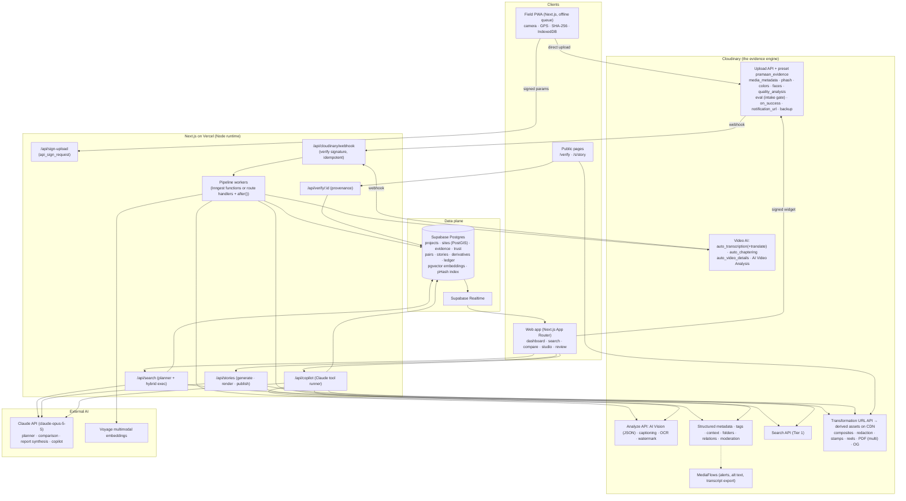
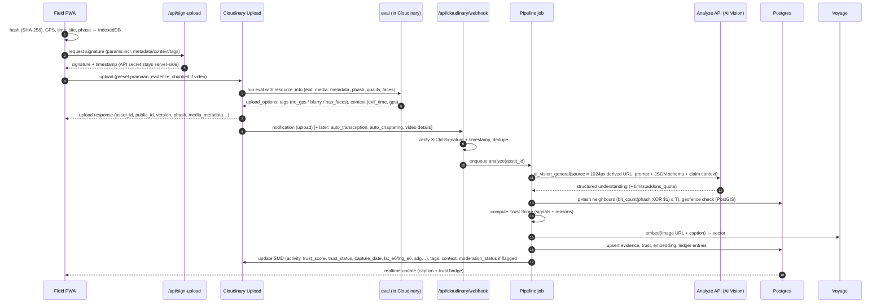
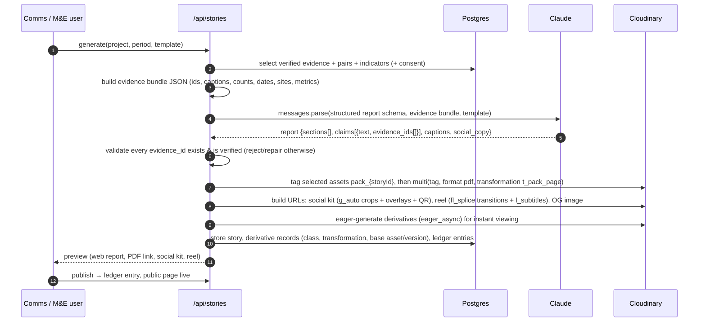

# 03 · System Architecture

> Principle: **Cloudinary does the media work (store, perceive, transform, deliver, lineage). Postgres keeps the relational and derived state (projects, sites, trust, embeddings, ledger). Claude does cross-asset reasoning (planning, comparison, narrative).** Next.js on Vercel orchestrates.

---

## 1. Component diagram

## 2. Ingest pipeline (sequence)

**Why both `eval` and the webhook?** `eval` runs *inside* Cloudinary before the asset is finalized: cheap, deterministic intake tags that exist even if our backend is down. The webhook job does the expensive, cross-asset work (AI Vision, pHash search, trust, embeddings). Showing both demonstrates real understanding of the platform.

## 3. Story generation (sequence)

## 4. Async job design

| Job | Trigger | Idempotency key | Retries | Notes |
|---|---|---|---|---|
| `analyze.image` | upload webhook (image) | `asset_id:version` | 3, exp. backoff; 429 → honor quota | AI Vision on the `t_ev_analysis` derived URL (`c_fit,w_1024,h_1024/f_jpg/q_auto:good`) |
| `trust.compute` | after analyze; after reviewer override; after new near-duplicate appears | `asset_id:version:rev` | 3 | Recompute neighbours when a new asset lands near an old one |
| `embed` | after analyze | `asset_id:version` | 3 | Voyage multimodal (image + caption) |
| `video.enrich` | upload webhook (video) | `asset_id` | – | Upload preset requests `auto_transcription` (+translate), `auto_chaptering`, `auto_video_details`; completion webhooks update DB |
| `video.visual` | manual "Deep analyze" button (cost-gated) | `asset_id` | poll job | AI Video Analysis; keyframes → AI Vision |
| `pair.suggest` | nightly + on new `after` evidence | `site_id:date` | – | Candidate pairs by site, time gap, embedding similarity |
| `pair.compare` | pair approved | `pair_id` | 3 | Composite URL → AI Vision comparison + ExG metric |
| `story.render` | user action | `story_id:rev` | 3 | Eager derivatives; `multi` PDF async |
| `ledger.anchor` (P2) | hourly | `hour` | – | Publish ledger head hash as a raw asset (tamper evidence) |

Implementation options: **Inngest** (durable steps, retries, free tier) is recommended; the simplest alternative is route handlers + Next.js `after()` for short work + a `jobs` table polled by a cron (Vercel Cron).

## 5. Webhook handling

- Endpoint: `/api/cloudinary/webhook` (Node runtime). Configure as **global notification URL** (Settings → Webhook notifications, or via the Environment Config MCP) **and** per-upload `notification_url` in the preset.
- **Verify signature**: Cloudinary sends `X-Cld-Timestamp` and `X-Cld-Signature`; recompute per the *Notification signatures* doc (Node SDK: `cloudinary.utils.verifyNotificationSignature(body, timestamp, signature, validFor)`) and reject stale timestamps.
- **Idempotency**: store `(asset_id, notification_type, version/batch_id)` in a `webhook_events` table with a unique constraint; ignore repeats.
- **Types we handle**: `upload`, `eager`, `moderation`, `info` (auto_transcription/auto_chaptering/auto_video_details completion), `multi` (PDF), related-asset changes, metadata changes.

## 6. Security model

| Concern | Control |
|---|---|
| Secrets | `CLOUDINARY_API_SECRET`, `ANTHROPIC_API_KEY`, `VOYAGE_API_KEY`, `SUPABASE_SERVICE_ROLE_KEY` server-only; never `NEXT_PUBLIC_*` (Skills rule) |
| Upload abuse | **Signed uploads only**; preset restricts formats, max size, folder; per-user rate limit on `/api/sign-upload` |
| Tenant isolation | Supabase RLS by `org_id`; Cloudinary asset folders per org; Search expressions always ANDed with `metadata.org_id=<org>` server-side |
| Search injection | Claude planner output validated against a **whitelist grammar** (allowed fields/operators) before execution |
| Original protection (P1) | Store originals as `type: authenticated`; serve via **signed URLs** (`sign_url: true`); public outputs only through named transformations with redaction |
| URL tampering (prod) | Enable **Strict transformations** (only named/eager transformations served) once templates are final |
| Webhook spoofing | Signature + timestamp verification |
| Prompt injection via images (e.g. text in a photo saying "ignore instructions") | Treat AI outputs as **data**; Claude prompts wrap evidence as quoted JSON; tools that write require human confirmation |
| PII | Face/minor flags; redaction policy; location coarsening on public pages; consent withdrawal → `invalidate: true` on derived + unpublish |

## 7. Scaling considerations (answer to "is it scalable?")

- **Media heavy lifting is on Cloudinary's CDN and processing fleet**; our servers only handle metadata and orchestration.
- **Analyze once**: per-asset AI results persisted; views never trigger AI.
- **pHash search**: `bit_count(phash # $1)` over a `bigint`/`bit(64)` column is fast for 10⁵ rows; at 10⁶+ use multi-index hashing (split the hash into 4 × 16-bit bands with B-tree indexes; candidates must match ≥ 1 band exactly for distance ≤ 3), or an HNSW index on embeddings for similar-scene search.
- **Embeddings**: pgvector HNSW index; per-org partial indexes.
- **Search**: Cloudinary Search API for metadata facets (scales to millions; Tier 1 ≤ 10 M assets), PostGIS for geo, pgvector for semantics; intersect by `asset_id`.
- **Rate limits**: Free-plan Admin API 500/h, so batch SMD updates (`update_metadata` supports multiple public IDs), prefer Upload API `explicit` (not rate-limited) and webhooks over polling.
- **Multi-tenant**: org → project → site hierarchy; folder-per-org; RLS; per-org taxonomy injected into AI prompts.

## 8. Deployment topology

| Piece | Where | Notes |
|---|---|---|
| Next.js app + API routes | Vercel (Hobby) | Node runtime for routes using `cloudinary` SDK (not Edge; Skills rule) |
| Postgres + Auth + Realtime + Storage (consent docs) | Supabase (Free) | Enable `postgis`, `vector`; keep warm (pauses after 7 days idle) |
| Jobs | Inngest Cloud (Free) or Vercel Cron | |
| Media | Cloudinary (Free, default US region) | Not Asia-Pacific (transcription/chaptering unsupported there) |
| AI | Anthropic API, Voyage API | Keys in Vercel env |
| Optional automation | MediaFlows (flag alerts to Slack/email), n8n (WhatsApp bridge) | |
