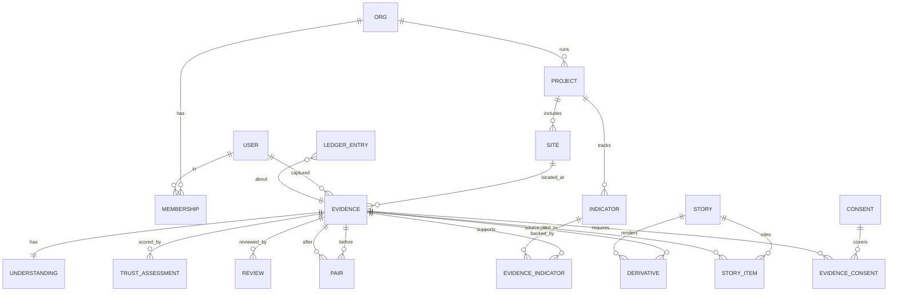

# 06 · Data Model: Cloudinary ↔ Postgres

> **Source-of-truth rule:** Cloudinary owns **media and media-intrinsic metadata** (bytes, versions, EXIF, derivatives, SMD values used for search/organization). Postgres owns **relational & computed state** (orgs, projects, sites/geofences, trust computations, pairs, stories, embeddings, ledger). Key fields are mirrored so either side can be searched, and every Postgres evidence row carries Cloudinary's immutable `asset_id` + `version`.

---

## 1. Cloudinary conventions

| Item | Convention | Example |
|---|---|---|
| `public_id` | `pramaan/<org_slug>/ev_<ULID>` (never reused, never overwritten) | `pramaan/green-aravalli/ev_01J9Z6Q2K8…` |
| `asset_folder` (dynamic folders) | `pramaan/<org>/<project>/<site>` | `pramaan/green-aravalli/aravalli-ws-2/GA-17` |
| Tags | lifecycle & grouping: `pramaan`, `intake_v1`, `no_gps`, `blurry`, `has_faces`, `edited_software`, `pair_<id>`, `pack_<storyId>`, `story_<storyId>` | |
| Context keys | `caption`, `alt`, `exif_time`, `device`, `software`, `source_url`, `phash`, `app_capture_time`, `gps_accuracy_m`, `uploader` | |
| SMD fields | 17 fields (see `04_cloudinary_integration_blueprint.md` §3) | `metadata.trust_score>=80` |
| Relations | before↔after, video↔transcript(raw), evidence↔story derivative assets | |
| Derived story assets (when materialized, e.g. PDF pages, slides) | `pramaan/<org>/stories/<storyId>/<kind>_<n>` with context `derived_from=<asset_id>@v<version>` + `transformation=<string>` + SMD `evidence_class` | |
| Raw assets | transcripts (`.transcript`), chapters (`-chapters.vtt`), visual transcripts (`.visual.transcript`), reel subtitles (`.vtt`), ledger anchors (`ledger/<hour>.json`) | |

## 2. Entity-relationship diagram



## 3. Postgres DDL (Supabase; extensions `postgis`, `vector`)

```sql
create extension if not exists postgis;
create extension if not exists vector;

create table org (
  id uuid primary key default gen_random_uuid(),
  slug text unique not null,
  name text not null,
  kind text check (kind in ('ngo','govt','csr','other')),
  created_at timestamptz default now()
);

create table app_user (
  id uuid primary key,                 -- = auth.users.id
  display_name text,
  phone text,
  created_at timestamptz default now()
);

create table membership (
  org_id uuid references org(id),
  user_id uuid references app_user(id),
  role text check (role in ('field_agent','reviewer','comms','org_admin','funder_viewer')),
  primary key (org_id, user_id)
);

create table project (
  id uuid primary key default gen_random_uuid(),
  org_id uuid not null references org(id),
  code text not null,                  -- mirrors SMD project_id enum value
  name text not null,
  summary text,
  funder text,
  start_date date, end_date date,
  sdgs text[],
  unique (org_id, code)
);

create table site (
  id uuid primary key default gen_random_uuid(),
  project_id uuid not null references project(id),
  code text not null,                  -- e.g. GA-17 (SMD site_id)
  name text, village text, district text, state text,
  setting text,
  geofence geography(Polygon, 4326),   -- or point + radius
  center geography(Point, 4326),
  radius_m int,
  unique (project_id, code)
);
create index on site using gist (geofence);

create table indicator (
  id uuid primary key default gen_random_uuid(),
  project_id uuid references project(id),
  code text, name text, unit text,
  target numeric, claimed numeric,     -- claimed from MIS/partner report
  activity text                        -- which activity's evidence supports it
);

create table evidence (
  id text primary key,                 -- ev_<ULID> (= public_id leaf)
  org_id uuid not null references org(id),
  project_id uuid references project(id),
  site_id uuid references site(id),
  -- Cloudinary identity
  cld_asset_id text unique not null,
  cld_public_id text not null,
  cld_version bigint not null,
  resource_type text check (resource_type in ('image','video','raw')),
  format text, bytes bigint, width int, height int, duration_s numeric,
  etag text,                           -- Cloudinary MD5 of the upload
  -- provenance
  source_channel text,
  captured_by uuid references app_user(id),
  client_sha256 text,
  client_resized boolean default false,
  app_capture_time timestamptz,
  exif_time timestamptz,
  device text, software text, source_url text,
  gps geography(Point, 4326),
  gps_accuracy_m numeric,
  geo_status text,
  phase text check (phase in ('before','during','after','monitoring')),
  activity_claimed text,
  -- intrinsic analysis
  phash bigint,
  green_pct numeric,                   -- from colors
  face_count int,
  quality_focus numeric,
  -- lifecycle
  trust_score int, trust_status text default 'pending',
  consent_status text default 'not_required',
  people_flags text[],
  created_at timestamptz default now()
);
create index on evidence using gist (gps);
create index on evidence (org_id, project_id, site_id, phase);
create index on evidence (phash);

create table understanding (
  evidence_id text primary key references evidence(id),
  ai_vision jsonb,                      -- full AI Vision JSON
  caption text, visible_text text,
  activity_detected text, activity_matches_claim text,
  transcript jsonb, transcript_en jsonb, chapters_vtt_url text,
  video_details jsonb, visual_transcript jsonb,
  model_meta jsonb,                     -- add-on, model_version, tokens used
  embedding vector(1024)                -- set to the embedding model's dimension
);
create index on understanding using hnsw (embedding vector_cosine_ops);

create table trust_assessment (
  id bigserial primary key,
  evidence_id text references evidence(id),
  version int not null,                 -- algorithm version
  score int not null, status text not null,
  signals jsonb not null,               -- [{id, group, weight, score, reason, source, hard_flag}]
  computed_at timestamptz default now()
);

create table review (
  id bigserial primary key,
  evidence_id text references evidence(id),
  reviewer uuid references app_user(id),
  decision text check (decision in ('verified','rejected','recapture_requested')),
  reason text,
  created_at timestamptz default now()
);

create table evidence_indicator (
  evidence_id text references evidence(id),
  indicator_id uuid references indicator(id),
  quantity numeric, quantity_source text check (quantity_source in ('ai_estimate','field_entry','reviewer')),
  primary key (evidence_id, indicator_id)
);

create table pair (
  id text primary key,                  -- pair_<ULID>
  site_id uuid references site(id),
  before_id text references evidence(id),
  after_id text references evidence(id),
  candidate_score numeric,
  status text check (status in ('suggested','approved','rejected')),
  ai_comparison jsonb,                  -- AI Vision on composite
  exg_before numeric, exg_after numeric, -- deterministic metric
  composite_url text,
  created_at timestamptz default now()
);

create table story (
  id text primary key,                  -- st_<ULID>
  org_id uuid references org(id),
  template text, period text, scope jsonb,
  report jsonb,                         -- Claude structured output
  citation_coverage numeric,
  status text check (status in ('draft','published','withdrawn')),
  published_at timestamptz
);

create table story_item (
  story_id text references story(id),
  evidence_id text references evidence(id),
  role text,                            -- hero, pair_before, pair_after, gallery, pack_page
  primary key (story_id, evidence_id, role)
);

create table derivative (
  id text primary key,                  -- dv_<shortId> (used in QR/verify URLs)
  base_evidence_id text references evidence(id),
  base_asset_id text not null,
  base_version bigint not null,
  story_id text references story(id),
  kind text,                            -- thumb, detail, public_safe, composite, social_9x16, reel, pdf_page…
  transformation text not null,         -- exact transformation string (the recipe)
  delivery_url text not null,
  class text check (class in ('transcoded','redacted','edited','ai_generated')),
  materialized_public_id text,          -- if uploaded as its own asset (slides, pdf pages)
  c2pa_signed boolean default false,
  created_at timestamptz default now()
);

create table consent (
  id uuid primary key default gen_random_uuid(),
  org_id uuid references org(id),
  subject_label text,                   -- non-identifying label, e.g. "SHG meeting 12 Aug participants"
  scope text check (scope in ('internal','public_redacted','public_full')),
  guardian_consent boolean default false,
  evidence_doc_public_id text,          -- photo/scan of consent form (authenticated)
  valid_until date, withdrawn_at timestamptz
);
create table evidence_consent (
  evidence_id text references evidence(id),
  consent_id uuid references consent(id),
  primary key (evidence_id, consent_id)
);

create table ledger_entry (
  seq bigserial primary key,
  org_id uuid,
  subject_type text, subject_id text,   -- evidence | derivative | story | pair
  event text,                           -- ingested, analyzed, scored, reviewed, derived, published, withdrawn
  payload jsonb not null,
  payload_hash text not null,           -- sha256(canonical_json(payload))
  prev_hash text not null,
  entry_hash text not null,             -- sha256(prev_hash || payload_hash || event || subject_id || ts)
  actor text, created_at timestamptz default now()
);
-- append-only: revoke update/delete; RLS read by org; public read of entries linked to published derivatives

create table webhook_event (
  key text primary key,                 -- asset_id:type:version
  payload jsonb, received_at timestamptz default now()
);
```

## 4. Field mapping (who writes what)

| Concept | Cloudinary | Postgres | Written by |
|---|---|---|---|
| Media bytes / versions | ✅ | `cld_asset_id`, `cld_version` | Upload |
| EXIF / GPS / device | `media_metadata`, context (`exif_time`, `device`) | `exif_time`, `gps`, `device` | `eval` + job |
| pHash | response `phash` + context | `phash` bigint | job |
| Org / project / site / phase / activity | SMD | FK columns | upload params (server-signed) + job |
| AI understanding | context `caption`, `alt`; SMD `activity`, `people_flags` | `understanding.*` | job |
| Trust | SMD `trust_score`, `trust_status`; moderation status | `trust_assessment`, `evidence.trust_*` | job / reviewer |
| Consent | SMD `consent_status` | `consent`, `evidence_consent` | admin / reviewer |
| Pairs | relations + tag `pair_<id>` | `pair` | job / reviewer |
| Derivatives | derived assets (URLs) or materialized assets | `derivative` | story render |
| Lineage/audit | versions, backups, derived listing | `ledger_entry` | every step |

## 5. Row-level security (Supabase) sketch
```sql
alter table evidence enable row level security;
create policy evidence_read on evidence for select
  using (org_id in (select org_id from membership where user_id = auth.uid()));
create policy evidence_write on evidence for insert
  with check (org_id in (select org_id from membership where user_id = auth.uid() and role in ('field_agent','reviewer','org_admin')));
-- public verify: expose a SECURITY DEFINER function returning only published-derivative provenance
```
