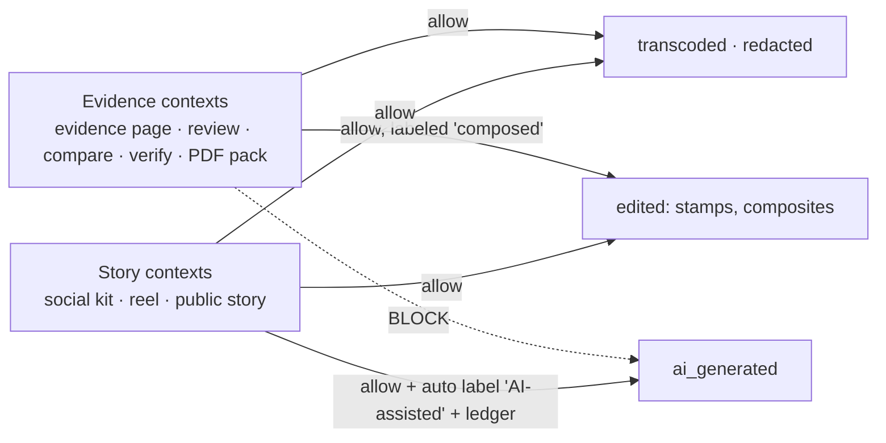

# 07 · Evidence Integrity & Traceability (PS goal R6)

> *"Preserve traceability to the original source assets and transformations."*
> This is the least likely goal to be built well by other teams and the one Cloudinary's architecture supports best. Pramaan implements it in five layers.

---

## Layer 1: Immutable originals (Cloudinary)

| Control | Implementation |
|---|---|
| Never overwrite | Preset: `overwrite: false`, `unique_filename: true`; public IDs are ULIDs |
| Backups & version history | Auto-backup ON; every restore/version is visible in the Media Library & Admin API |
| Pin exact version | Every derivative URL includes `v<version>`; `derivative.base_version` stored |
| Content hash | Client SHA-256 computed **before** upload (Web Crypto) → SMD `client_sha256`; Cloudinary `etag` (MD5 of the uploaded bytes) stored; mismatch → integrity warning |
| Remote-origin provenance | `eval` writes `resource_info.source_url` into context for URL/Drive/Dropbox uploads (Aug 2026 feature) |
| Protected originals (P1) | `type: authenticated` originals; signed delivery URLs; public views only via redaction templates |

## Layer 2: Classified derivatives ("the URL is the recipe")

Every image or video Pramaan shows or publishes is a **declared derivative** recorded in `derivative` with its **exact transformation string**. Each is classified with the same idea Cloudinary uses for C2PA (*transcoded vs edited*), extended with *redacted* and *AI-generated*:

| Class | Rule | Examples | Allowed in |
|---|---|---|---|
| **transcoded** | Only `c_fit`, `c_mfit`, `c_pad`, `c_lpad`, `c_mpad`, `c_scale` with a single dimension, `f_*`, `q_*` (Cloudinary's C2PA "transcoded" allowlist). Our classifier also admits non-destructive qualifiers `c_limit`, `dpr_`, `ar_` (with pad) and solid `b_` padding colours. That is **our extension**; Cloudinary's C2PA would label `c_limit` as "edited", so use `c_fit`/single-dim `c_scale` for C2PA-signed evidence views. | `c_fit,w_1600/f_auto/q_auto` | Evidence views, verify page |
| **redacted** | transcoded + privacy effects only: `e_pixelate_faces`, `e_blur_faces`, `e_blur_region`, `e_pixelate_region` | `t_public_safe` | Evidence views (public), stories |
| **edited** | Any other non-generative transformation (crops, overlays, text, color, splicing, stamps) | composites, stamps, social cards, reels | Stories, compare views (labeled "composed") |
| **ai_generated** | Any `e_gen_*`, `b_gen_fill`, `e_background_removal`, `e_extract`, `e_upscale`, `e_gen_restore`, `e_auto_enhance`/`e_enhance`/`e_improve`, Image Generation, Image-to-Video | 9:16 gen-fill extension | Stories only, **auto-labeled "AI-assisted"** |

Classifier sketch (runs on every URL we build; the builder refuses disallowed classes per context):
```ts
const TRANSCODED = [/^c_(fit|mfit|pad|lpad|mpad|limit)$/, /^[wh]_\d+$/, /^f_[a-z:]+$/, /^q_[a-z:0-9]+$/, /^dpr_[\d.]+$/, /^b_(white|black|rgb:[0-9a-f]{6})$/, /^ar_[\d:.]+$/, /^v\d+$/];
const REDACT   = [/^e_(pixelate|blur)_faces(:\d+)?$/, /^e_(pixelate|blur)_region(:\d+)?$/, /^g_ocr_text$/];
const GENERATIVE = [/^e_gen_/, /^b_gen_fill/, /^e_background_removal/, /^e_extract/, /^e_upscale/, /^e_(auto_)?enhance/, /^e_improve/];

export function classify(transformation: string): "transcoded"|"redacted"|"edited"|"ai_generated" {
  const params = transformation.split("/").flatMap(c => c.split(","));
  if (params.some(p => GENERATIVE.some(r => r.test(p)))) return "ai_generated";
  const isT = (p: string) => TRANSCODED.some(r => r.test(p));
  const isR = (p: string) => REDACT.some(r => r.test(p));
  if (params.every(isT)) return "transcoded";
  if (params.every(p => isT(p) || isR(p))) return "redacted";
  return "edited";
}
```
Named transformations (`t_*`) are expanded to their definitions before classifying (we keep a local registry mirroring what the MCP created).

## Layer 3: The generative firewall


- The URL builder takes a `context` (`evidence` | `story`) and throws if a disallowed class is requested.
- AI-generated story outputs get a visible label overlay (e.g. small "AI-assisted" badge via text layer) and `evidence_class=ai_generated`.
- Pitch line: *"GenAI can make a campaign prettier. It can never make evidence."*

## Layer 4: Tamper-evident ledger (hash chain)

Every meaningful event appends an entry:

```
payload_hash = SHA-256(canonical_json(payload))
entry_hash   = SHA-256(prev_hash ‖ event ‖ subject_type ‖ subject_id ‖ payload_hash ‖ created_at)
```
Events: `ingested` (asset_id, version, client_sha256, etag, capture metadata), `analyzed` (model, add-on, output hash), `scored` (algorithm version, score, signal digest), `reviewed` (reviewer, decision, reason), `paired`, `derived` (base asset/version, transformation, class, URL), `published`, `withdrawn` (consent), `redaction_applied`.

- Append-only (no UPDATE/DELETE grants); verification endpoint recomputes the chain for any subject.
- **Anchoring (P2):** hourly, upload `ledger/<yyyy-mm-dd-hh>.json` (head hash + count) to Cloudinary as a **raw asset with backup**, so the head hash is stored in a second system with its own version history. Optional: publish the daily head hash on the public site / in a GitHub commit for third-party timestamping.
- Pitch framing: "It's not a blockchain; it's a hash chain with an external anchor. Simple, cheap, and verifiable."

## Layer 5: Public verification (`/verify/<derivativeId>` + QR)

Every outgoing visual (social card, PDF page, reel end-card, public story image) carries a small **QR + short URL** overlaid via Cloudinary (`l_pramaan:qr:<shortId>`), generated once per derivative and uploaded as a tiny PNG asset.

The verify page shows:
1. The published derivative (as delivered).
2. **Lineage chain**: original (or a redacted view if no public consent) → each transformation step with its class badge → the published output; the exact transformation string (the recipe) and version.
3. **Capture provenance**: time, place (optionally coarsened to ~1 km), channel, device model, GPS accuracy.
4. **Integrity**: client SHA-256 ↔ Cloudinary etag match; version history; ledger entries with hash verification status (✓ chain valid).
5. **Trust**: score, key signals, reviewer decision.
6. **Content Credentials**: "Signed with C2PA via Cloudinary" + link to `verify.contentauthenticity.org` (when `fl_c2pa` is enabled), else "not enabled".

## C2PA plan (Cloudinary `fl_c2pa`, beta on request)
- Request access on day 0 (support ticket).
- If granted: append `fl_c2pa` to **public image deliveries** (supported output formats: avif, heic/heif, jpg/jpeg, png, svg, tif/tiff, webp). Cloudinary adds a manifest on top of existing manifests, marks previous invalid signatures, and classifies actions as *transcoded* or *edited*, which is consistent with our classes.
- Demonstrate: download a social card → drop it into verify.contentauthenticity.org → shows Cloudinary's signature and edit history.
- If not granted: show the adapter (`withProvenanceFlag(url)`) and state it's ready; our own ledger + verify page provide the guarantees independently.

## Consent & redaction policy engine

| Condition | Public output policy |
|---|---|
| `face_count = 0` | transcoded/edited as normal |
| faces present, consent `public_full` | allowed unredacted |
| faces present, consent `public_redacted` / `pending` / none | **`t_public_safe`** (pixelate faces) enforced by the URL builder |
| `minors_likely` and no guardian consent | pixelate + exclude from hero images; never in social kit |
| visible documents/phone numbers (OCR) | `t_public_safe_ocr` (region blur via `g_ocr_text`) |
| consent withdrawn | unpublish stories using the asset; `invalidate: true` on derived assets; ledger `withdrawn` entry; originals restricted |

## What to demo for R6 (60 seconds)
1. Scan the QR on a social card shown on the projector → verify page opens on a judge's phone.
2. Show the lineage: original (faces pixelated for public) → crop + stamp (edited) → 9:16 extension (**AI-assisted**, labeled) → published.
3. Show "Ledger ✓ valid (142 entries)", the SHA-256/etag match, and the reviewer decision.
4. (If granted) show Cloudinary's C2PA manifest in the CAI verify tool.
