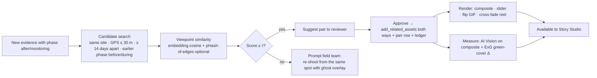

# 08 · Before/After Engine (PS goal R3)

> *"Compare before-and-after media to demonstrate visible project or environmental changes."*
> Most teams will put two images side by side. Pramaan **finds** the right pairs, **checks** they're comparable, **shows** the change in four formats, and **measures** it with a disclosed method.

---

## 1. Pipeline



## 2. Pairing algorithm

**Candidate generation** (SQL + PostGIS):
```sql
select b.id as before_id, a.id as after_id,
       st_distance(a.gps, b.gps) as dist_m,
       a.exif_time - b.exif_time as gap,
       1 - (ua.embedding <=> ub.embedding) as sim
from evidence a
join evidence b on b.site_id = a.site_id and b.id <> a.id
join understanding ua on ua.evidence_id = a.id
join understanding ub on ub.evidence_id = b.id
where a.id = $1
  and b.phase in ('before','during')
  and a.exif_time - b.exif_time >= interval '14 days'
  and (a.gps is null or b.gps is null or st_dwithin(a.gps, b.gps, 30))
  and b.trust_status = 'verified'
order by sim desc limit 5;
```

**Candidate score** (0–1): `0.5·sim + 0.2·(1 − dist_m/30) + 0.2·phase_order_ok + 0.1·same_activity`. Threshold τ ≈ 0.65 (calibrate on seed data).

**Repeat-photography assist (field UX, P1):** when a site has a `before` photo, the capture screen shows it as a **semi-transparent "ghost" overlay** so the field agent can match the framing. The ghost is a Cloudinary derivative, `c_fill,w_720,h_960,g_auto/o_35/…`, loaded and cached offline. This improves comparability at the source and is a nice field-empathy detail for judges.

## 3. Presentation formats

| Format | How | Cloudinary features |
|---|---|---|
| **Slider** | `react-compare-slider` with two `CldImage`s using identical `c_fill,g_auto,w_1200,h_900` | `g_auto` consistent crops |
| **Labeled composite** | Single URL: before half + after half side-by-side, date labels, site code, trust badge (see blueprint §7) | `l_` overlay with `g_west,x_<w>`, text layers |
| **Flip GIF / animated WebP** | Tag both halves `pair_<id>` → `multi` animated, or `f_auto:animated` from a 2-frame video | `multi` / animated formats |
| **Cross-fade reel (6 s)** | Blank base video + `fl_splice:transition_(name_fade;du_2)` before → after, subtitles "Mar 2025 → Sep 2026" | video splice + transitions + `l_subtitles` |
| **Vertical story (9:16)** | Stacked composite (`g_north,y_<h>` canvas extension) for Instagram/WhatsApp status | vertical canvas extension |
| (Story-only, optional) **"Living" transition** | Image-to-Video with start frame = before, end frame = after, preset "Time Lapse". **Labeled AI-generated**, never evidence | Image-to-Video add-on (16 free trial seconds) |

## 4. Measuring change

### 4.1 AI Vision on the composite ("compose, then perceive")
One `ai_vision_general` call on the composite URL with schema:
```json
{
  "type": "object",
  "properties": {
    "same_location": {"type": "string", "enum": ["yes","no","uncertain"]},
    "viewpoint_similarity": {"type": "integer", "description": "0-100"},
    "changes": {"type": "array", "items": {"type": "string"}, "description": "Concrete visible changes, left (BEFORE) to right (AFTER)"},
    "vegetation_change": {"type": "string", "enum": ["large_increase","increase","no_change","decrease","large_decrease","not_applicable"]},
    "construction_progress": {"type": "string", "enum": ["none","started","partial","substantial","complete","not_applicable"]},
    "water_change": {"type": "string", "enum": ["more_water","same","less_water","not_applicable"]},
    "caveats": {"type": "array", "items": {"type": "string"}, "description": "Season, lighting, angle differences that limit comparison"},
    "confidence": {"type": "integer"}
  },
  "required": ["same_location","viewpoint_similarity","changes","vegetation_change","construction_progress","water_change","caveats","confidence"],
  "additionalProperties": false
}
```
If `same_location ≠ yes` or `viewpoint_similarity < 50` → pair downgraded to "needs review"; optionally ask Claude for a second opinion with both images.

### 4.2 Deterministic metric: Excess Green (ExG) green-cover index
A classic RGB vegetation index (Woebbecke et al., 1995) that is explainable and cheap, and needs no ML:

1. Fetch both halves as **identical-geometry** small derivatives: `c_fill,g_auto,w_256,h_192/f_png` (from Cloudinary; 1 tx each, cached).
2. For each pixel, chromatic coordinates `r = R/(R+G+B)`, `g = G/(R+G+B)`, `b = B/(R+G+B)`; **ExG = 2g − r − b**.
3. Pixel is "green vegetation" if ExG > t (start with t = 0.05; or Otsu's threshold per image).
4. Green cover % = green pixels / total. **Δ = after − before** (percentage points).
5. Display with the method and caveats ("indicative; sensitive to season, lighting and framing").

Implementation: Node `sharp` → raw RGB buffer → loop (≈50k pixels, milliseconds). Store `exg_before`, `exg_after` on the pair. Cross-check with Cloudinary's `colors` output (percent green) as a sanity signal.

### 4.3 Other metrics by activity (optional)
| Activity | Metric | Source |
|---|---|---|
| Plantation | Sapling count estimate before/after (survival proxy) | AI Vision `visible_counts` (labeled estimate) + field entry |
| Construction (check dam, classroom, toilet) | Stage progression (`construction_stage`) | AI Vision per image + composite |
| Water body restoration | Water present / extent change | AI Vision `water_present`, `water_change` |
| Waste management | Litter presence change | AI Vision |

## 5. Story integration
Approved pairs feed Story Studio: hero before/after for reports, composite in PDF packs (with QR), reels in the social kit, sliders on public story pages, and a "Change evidence" section listing each pair's metrics **with methods and caveats**.

## 6. Demo script (45 s)
1. Open site GA-17 timeline → "2 suggested pairs".
2. Approve → slider appears (drag).
3. Click **Composite** (the Cloudinary URL is shown in the pipeline inspector) → **Reel** plays the cross-fade.
4. Metrics card: "Green cover 12% → 43% (+31 pts, ExG method)", AI: "Saplings established along the bund; tree guards visible; soil moisture higher", caveats: "monsoon season in after-image".
