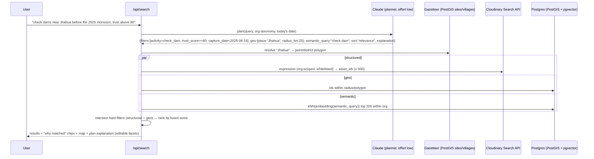

# 09 · Search & Discovery (PS goal R5)

> *"Make media searchable through AI-powered metadata, tagging, and semantic discovery."*
> Constraint: Cloudinary **Visual Search** is Enterprise-only and **Search API Tier 2** (geo `location:`, EXIF `taken_at`, `colors`, `face_count`…) is Advanced-plan-on-request. Design: **Cloudinary Search API (Tier 1) over our structured metadata** + **PostGIS** for geography + **pgvector** for semantics, fused, with an explanation for every hit.

---

## 1. Three retrieval channels

| Channel | Engine | Good at | Example |
|---|---|---|---|
| **Structured** | **Cloudinary Search API** (Tier 1) over SMD fields, tags, folders, dates, resource type | Exact facets: project, activity, phase, trust, consent, date ranges | `metadata.activity=check_dam AND metadata.trust_score>=80 AND metadata.capture_date<2025-06-15` |
| **Geographic** | PostGIS (`ST_DWithin`, `ST_Contains`) over `evidence.gps` + site geofences (mirrored `lat_e6/lng_e6` SMD for Tier-1 bounding boxes) | "near Jhabua", "within 5 km of site GA-17", map viewport | `ST_DWithin(gps, ST_Point(74.59, 22.77)::geography, 20000)` |
| **Semantic** | Voyage multimodal embeddings in pgvector (HNSW, cosine) | Meaning: "stone check dam across a dry stream", "women's SHG meeting under a tree" | kNN on query embedding |

Plus **near-duplicate** lookup (pHash Hamming) for "find copies of this photo" and **find-similar** (embedding kNN from an asset).

## 2. Query flow

**Hard vs soft constraints:** filters from the planner (activity, trust, dates, geo) are **hard** (intersection). The semantic score only **ranks** within the filtered set, unless the query is purely descriptive (no filters), in which case semantic top-k is the candidate set.

**Fusion:** Reciprocal Rank Fusion over (semantic rank, recency rank, trust rank), with weights by `sort` intent: `score = Σ w_k / (60 + rank_k)`.

## 3. Planner → Cloudinary expression compiler

- Planner output is a typed `SearchPlan` (see `05_ai_pipeline_design.md` §4.1): **no free-text expression from the LLM reaches Cloudinary**.
- Compiler maps each filter to a Tier-1 clause from a whitelist:

| Plan filter | Cloudinary clause |
|---|---|
| `activity = X` | `metadata.activity=X` |
| `phase = X` | `metadata.phase=X` |
| `trust_score >= N` | `metadata.trust_score>=N` |
| `trust_status = X` | `metadata.trust_status=X` |
| `capture_date < D` | `metadata.capture_date<D` |
| `project_id = X` | `metadata.project_id=X` |
| `sdg = SDG15` | `metadata.sdg=SDG15` |
| `resource_type = video` | `resource_type:video` |
| always | `metadata.org_id=<org>` (server-injected) |
| bbox (when map viewport) | `metadata.lat_e6>=A AND metadata.lat_e6<=B AND metadata.lng_e6>=C AND metadata.lng_e6<=D` |

- Values are escaped/validated against enums (activity, phase…) and date/number formats.
- Paginate with `next_cursor`; request `with_field('metadata')`, `with_field('context')`, `with_field('tags')`.
- **Rate limit awareness** (Admin API 500/h on Free applies to Admin endpoints; check Search's quota in your account's response headers via `cloudinary-embed-headers` on MCP or response headers). Cache search results for 60 s per (org, plan hash).

> Why still use Cloudinary Search if Postgres has the same fields? (1) It is the system of record for media metadata and reflects edits made in the Media Library by NGO staff; (2) it proves Tier-1 search + SMD integration to judges; (3) on an Advanced/Enterprise plan the same planner can switch geo/EXIF/visual clauses to native Cloudinary (`location:`, `taken_at:`, Visual Search) with no UI change. Keep a `SEARCH_MODE=hybrid|cloudinary_native` flag.

## 4. "Why matched" explanations
Each result shows chips derived from the plan and scores:
- `activity = check_dam` ✓ (AI Vision, conf. high)
- `2.1 km from Jhabua` (GPS ±6 m)
- `captured 02 Jun 2025` (before 15 Jun)
- `trust 88 · verified`
- `semantic 0.81: "masonry check dam across a dry nala with stone apron"` (from `scene_summary`)

Clicking a chip removes/edits that facet (the plan is editable, not a black box).

## 5. Faceted browsing (no AI needed)
Left rail facets (counts from Postgres; Tier-2 aggregations are premium): Project · Site · Activity · Phase · SDG · Trust status · Consent · Media type · Source channel · Date histogram. Map viewport acts as a geo filter.

## 6. Example queries the demo should nail

| Query | Plan highlights |
|---|---|
| "Show check dams near Jhabua before the 2025 monsoon with trust above 80" | activity, geo (Jhabua 25 km), date < 2025-06-15, trust ≥ 80 |
| "Photos with children that don't have consent" | people_flags ∋ minors_likely, consent_status ∈ {pending, none} (reviewer only) |
| "Flagged photos uploaded by the same person this week" | trust_status = flagged, date ≥ now−7d, group by uploader |
| "Tree plantation sites with no after photo yet" | → Copilot tool `sites_missing_phase` (not plain search) |
| "Videos where people talk about water availability" | resource_type video + semantic over transcript text |
| "Find copies of this photo" | pHash neighbours (distance ≤ 10) across projects |
| "Waterlogged roads" (no taxonomy match) | semantic only |

## 7. Evaluation
- 20 benchmark queries with hand-labeled relevant sets from the seed corpus → report **Recall@10** and **nDCG@10** for (structured only) vs (semantic only) vs (hybrid). A small table in the README shows why hybrid wins.
