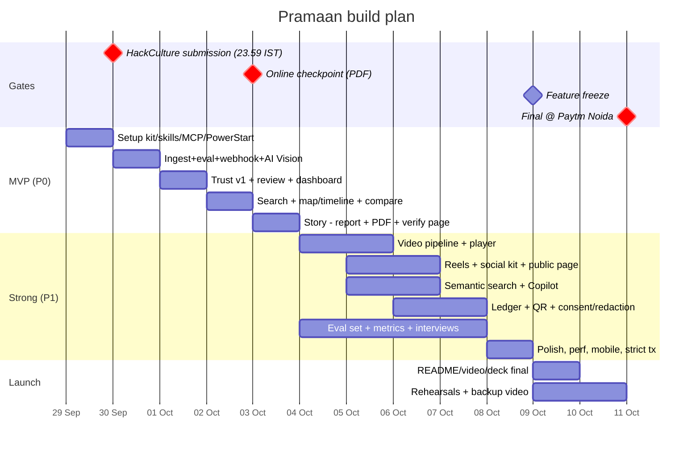

# 01 · Build Plan: Tue 29 Sep → Sun 11 Oct 2026

> Two hard constraints shape everything: **HackCulture Project Submission closes Wed 30 Sep 23:59 IST** (and finalists are picked on GitHub/LinkedIn profiles), and the **"3 Oct online"** checkpoint. So the plan is **"always shippable"**: a deployed, working vertical slice by tomorrow night, then widen.

---

## 1. Team roles (4 people; merge if fewer)

| Role | Owns | Key deliverables |
|---|---|---|
| **A · Frontend/UX** | Next.js pages, PWA capture + offline queue, map/timeline, slider, Studio UI, verify page | Polished, mobile-first UI; demo flow |
| **B · Cloudinary pipeline** | Presets, SMD schema, `eval`, webhooks, URL builders + classifier, composites/reels/PDF/social kit, MediaFlows, MCP setup | Integration blueprint implemented; `PROMPTS.md` entries |
| **C · AI & trust** | AI Vision schema/prompts, trust engine, pHash index, embeddings, Claude planner/report/Copilot, evaluation set & metrics | Trust v1 + eval numbers; report quality |
| **D · Product, data & story** | Interviews, taxonomy, seed corpus capture (with GPS), labeled fraud set, README, video, LinkedIn posts, forms, pitch deck | Submission-ready narrative & assets |

Solo/duo fallback: B+C merge (pipeline+AI), A+D merge (UI+story).

## 2. Timeline

## 3. Day-by-day

### Day 0 · Tue 29 Sep (tonight): foundation (3–4 h)
- [ ] Create Cloudinary account (default region) **or** use a Claimable Cloud via AI Power Start, then claim it.
- [ ] `npx create-cloudinary-next` (Claude Code + Cursor) → `pramaan/`; push to a **public GitHub repo** with a first commit ("scaffold from create-cloudinary-next").
- [ ] Install Skills (`npx skills add cloudinary-devs/skills`); paste **AI Power Start** prompt; commit `docs/cloudinary-environment.json` + preview HTML.
- [ ] Console: enable auto-backup, **PDF/ZIP delivery**, subscribe Free tiers (AI Vision, Content Analysis, OCR, Google Tagging, Google Translation); record quotas in `docs/quotas.md`.
- [ ] File support tickets: C2PA beta, Duplicate Detection beta; ask DevRel on Discord for a hackathon credit boost.
- [ ] Supabase project (enable `postgis`, `vector`); Vercel project linked; env vars set.
- [ ] Start `PROMPTS.md` and `CREDITS.md`.
- [ ] D: write the README skeleton (problem, solution, architecture diagram from these docs, "How we use Cloudinary" table as a plan).

### Day 1 · Wed 30 Sep: vertical slice live + **submit on HackCulture**
- [ ] B: via MCP create SMD fields, presets (`pramaan_evidence`, video), named transformations, webhook trigger (log prompts).
- [ ] B: `/api/sign-upload`, `/api/cloudinary/webhook` (signature + idempotency), `eval` intake gate.
- [ ] C: `analyze.image` job with AI Vision JSON schema; write-back to SMD + DB.
- [ ] A: `/import` (signed `CldUploadWidget`), evidence grid (`t_ev_thumb`), evidence detail with understanding panel.
- [ ] D: capture 60–100 seed photos with GPS at 2–3 local "sites" (park plantation, construction site, school/community space); define 2 demo orgs/projects/sites/geofences.
- [ ] **By 21:00:** deployed on Vercel; README with live link + test login + architecture; **submit on HackCulture before 23:59**; each member posts on LinkedIn.

### Day 2 · Thu 1 Oct: verify
- [ ] C: trust engine v1 (geofence, EXIF/time, pHash distance, recapture, claim match, quality) + explanations.
- [ ] A: review queue (keyboard), trust panel, project dashboard (KPIs, map, timeline).
- [ ] B: flagged → `explicit(moderation: manual)`; reviewer decisions → moderation status + SMD.
- [ ] D: build the labeled fraud set (recaptures, recycled, synthetic via Cloudinary Image Generation, wrong location).

### Day 3 · Fri 2 Oct: find & compare
- [ ] C: planner (Claude structured output) + compiler → Cloudinary Search API; PostGIS geo; "why matched".
- [ ] B: composite URL builder, flip GIF, pair approval → `add_related_assets`; AI Vision on composite; ExG metric.
- [ ] A: search page + compare page (slider).
- [ ] D: record a **draft 3-min walkthrough**; draft Cloudinary form answers.

### Day 4 · Sat 3 Oct: tell (+ online checkpoint)
- [ ] C: report synthesis (Claude `messages.parse` + Zod) with citation validation.
- [ ] B: evidence cards → materialize → `multi` PDF; verify page + QR overlays.
- [ ] A: Studio wizard (scope → evidence → generate → preview).
- [ ] **Submit the Cloudinary Google Form** (Code Cubicle 2026) with live URL, repo, and video. Update later if allowed.

### Days 5–8 · Sun 4 → Wed 7 Oct: strong tier
- Video: preset with transcription+translate, chaptering, video details; `CldVideoPlayer` with chapters/captions; AI Video Analysis on 2–3 hero clips; keyframes.
- Reels (splice + transitions + subtitles) and social kit (4 formats, labeled gen-fill ≤ 5 uses); public story page with OG.
- Semantic search (Voyage + pgvector), find-similar; Evidence Copilot (tool runner, confirm-before-write).
- Ledger hash chain + anchoring; consent model + redaction enforcement; generative firewall tests.
- MediaFlows flagged-evidence alert (built via MediaFlows MCP; log the prompt).
- Evaluation: run the labeled set; compute precision/recall; search Recall@10/nDCG@10; add to README.
- D: 2–3 user interviews → quotes; pitch deck v1; LinkedIn progress posts.

### Day 9 · Thu 8 Oct: polish
- Mobile pass, loading/empty/error states, Lighthouse, accessibility (alt text, contrast), copy editing.
- Eager-generate all demo derivatives; **Strict transformations ON**; credit check (target ≤ 70% used).
- Playwright smoke test on production.

### Day 10 · Fri 9 Oct: freeze & rehearse
- Feature freeze at noon. README final (integration map with URLs, eval results, credits, prompts summary).
- Record the **final 2–4 min video** (also the backup for the finals).
- 3 timed rehearsals of the 3-min pitch + Q&A drill (`03_demo_and_pitch.md`).

### Day 11 · Sat 10 Oct: logistics
- Travel; keep Supabase warm (a cron ping); verify the live URL from mobile data; offline kit (video file, screenshots, PDF pack) on 2 laptops + USB.

### Day 12 · Sun 11 Oct: Final at Paytm, Noida (09:00–18:00)

## 4. Scope-cut ladder (if behind schedule)
Cut in this order; never cut the P0 vertical slice:
1. Copilot agent → keep NL search only.
2. Semantic embeddings → structured + geo search only.
3. Reels → keep flip GIF + composite.
4. Video AI Video Analysis → keep transcription/chapters only.
5. Ledger anchoring → keep hash chain.
6. PWA offline → online capture only (keep the offline queue as a "stretch" slide).

## 5. Definition of done (per feature)
- Works on the **production URL** with seed data, on desktop + mobile.
- Cloudinary calls visible in the pipeline inspector.
- Covered by a README line in "How we use Cloudinary".
- Prompt(s) used logged in `PROMPTS.md`.
- No secret exposure; errors handled; credit impact noted.
